# NeuroAnalyst

NeuroAnalyst is a comprehensive framework for standardizing and automating neuroimaging data processing workflows. It transforms Python functions into complete, BIDS-compliant processing pipelines with containerized execution, rich metadata management, and high-performance computing integration.

<p align="center">
  
</p>

## Key Features

- **Function-to-Pipeline Transformation**: Convert Python functions into complete processing workflows
- **BIDS Compliance**: Automatic dataset validation and metadata generation
- **Containerization**: Generate Singularity containers with all dependencies
- **Generic ID Framework**: Unified identification system across all components
- **Template-Based Generation**: Standardized script and container creation
- **HPC Integration**: Optimized for high-performance computing environments (SLURM, PBS, LSF)
- **Pipeline Orchestration**: Build complex workflows with dependency management

## Core Components

NeuroAnalyst is organized into several key components:

1. **NeuProcessLogic**: Defines the computational logic and interfaces
2. **NeuProcessDir**: Generates script-based process execution environment
3. **NeuProcess**: Creates containerized execution environment
4. **NeuProcessExec**: Handles runtime configuration and execution
5. **NeuPipeline**: Orchestrates multi-step processing workflows
6. **Web API**: FastAPI-based RESTful interface for managing processes and pipelines

## Web API

NeuroAnalyst provides a comprehensive RESTful API for interacting with the framework:

- Create and manage processes and pipelines
- Execute processes on neuroimaging data
- Monitor execution status and retrieve results

To start the API server:

```bash
./run_api.sh
```

API documentation is available at:
- Swagger UI: http://localhost:8000/docs
- ReDoc: http://localhost:8000/redoc

## Enhanced Features ✨

- **MongoDB Integration**: Store and manage process metadata and results in MongoDB
- **Sync Framework**: Synchronize processes, executions, pipelines, and logs between HPC storage and database
- **Bidirectional Sync**: Transfer data from HPC to DB or DB to HPC with difference tracking
- **Comprehensive Logging**: Automatic log collection and centralized storage

### 1. **Auto-inference of Execution Mode**
- **Simplified API**: Single `process` parameter automatically detects container vs script execution
- **Type-based Detection**: `NeuProcess` → container mode, `NeuProcessDir` → script mode
- **Backward Compatibility**: Legacy factory methods still supported

```python
# New simplified interface - auto-detects execution mode
process_exec = NeuProcessExec.create(
    process=neuprocess_dir,  # Single parameter, mode auto-detected
    pipeline_name="analysis",
    pipeline_id="PL-123456",
    bids_root="/data/bids"
)
```

### 2. **Virtual Environment Command Generation**
- **Intelligent Execution**: Automatic virtual environment activation for script-based processing
- **Flexible Configuration**: Support for custom Python executables and activation commands
- **Package Management**: Integrated with Python package requirements

```python
config = NeuProcessDirConfig(
    python_packages=["numpy", "pandas", "nibabel"],
    venv_python_executable="/path/to/venv/bin/python",
    venv_activation_command="source /path/to/venv/bin/activate"
)
```

### 3. **Mount & Environment Variable Validation**
- **Override Support**: Fine-grained control over container mounts and environment variables
- **Validation**: Automatic validation of required vs optional configurations
- **Flexible Configuration**: Add or override mounts and env vars at execution time

```python
exec_config = NeuProcessExecConfig(
    container_mount_overrides={"/data": "/custom/data/path"},
    additional_container_mounts=["/scratch:/scratch:rw"],
    env_var_overrides={"CUSTOM_VAR": "new_value"},
    additional_env_vars={"NEW_VAR": "value"}
)
```

### 4. **Enhanced HPC Scheduler Support**
- **Multi-Scheduler Support**: Full support for SLURM, PBS, and LSF schedulers
- **Unified Interface**: Same API for all three major HPC schedulers
- **Resource Management**: Automatic resource directive generation

```python
# Generate scripts for any HPC scheduler
for scheduler in ["slurm", "pbs", "lsf"]:
    hpc_script = process_exec.generate_hpc_script(
        job_name="analysis_job",
        scheduler=scheduler,
        partition="compute",
        account="research_lab"
    )
```

## Quick Setup

### Environment Setup

First, set up the NeuroAnalyst environment:

```bash
# Clone the repository
git clone https://github.com/chinmaymokashicm/neuroanalyst.git
cd neuroanalyst

# Run setup script (creates virtual environment, installs dependencies, sets environment variables)
source setup.sh
```

This creates the following directory structure:

```
~/neuroanalyst/
├── apptainer/images/      # Singularity images (base, processes, pipelines)
├── working_dirs/          # Temporary processing directories
├── reports/               # Generated reports and outputs
├── logs/                  # Framework log files
└── datasets/              # BIDS datasets and derivatives
```

### Basic Usage

#### 1. Create a Processing Function

```python
from pathlib import Path
from src.neuroanalyst.utils.constants import NeuroAnalystPaths
from src.neuroanalyst.models.process.wrapper import neuprocess_decorator, NeuProcessDecoratorConfig
from src.neuroanalyst.models.process.dir.core import NeuProcessDir, NeuProcessDirConfig
from src.neuroanalyst.models.process.logic.core import NeuProcessLogic, NeuProcessLogicArgument, NeuProcessKind
from src.neuroanalyst.models.about import About

# Define your analysis function using the decorator approach
@neuprocess_decorator(NeuProcessDecoratorConfig(
    pipeline_name="brain_volume_analysis",
    bids_root="/path/to/your/bids/dataset",
    overwrite=True
))
def brain_volume_analysis(input_filepath):
    """Calculate brain volume from structural MRI."""
    import nibabel as nib
    import numpy as np
    
    # Load the image
    img = nib.load(input_filepath)
    data = img.get_fdata()
    
    # Simple brain volume calculation
    brain_volume = np.sum(data > 0) * np.prod(img.header.get_zooms())
    
    # Return structured output
    return {
        "data": f"Brain volume: {brain_volume:.2f} mm³",
        "description": "Brain volume analysis results",
        "metadata": {
            "brain_volume_mm3": brain_volume,
            "voxel_count": np.sum(data > 0),
            "voxel_size": img.header.get_zooms()[:3],
            "processing_method": "Thresholding-based volume calculation"
        }
    }
```

#### 2. Alternative: Create NeuProcessLogic Manually

```python
# File-level processing example
logic = NeuProcessLogic(
    about=About(
        name="brain_volume_analysis",
        description="Brain volume calculation pipeline",
        author="Your Name",
        version="1.0.0"
    ),
    kind=NeuProcessKind.FILE,  # File-level processing
    arguments=[
        NeuProcessLogicArgument(
            name="input_filepath",
            type="str",
            description="Path to the input NIfTI file"
        )
    ],
    code='''
import nibabel as nib
import numpy as np

def brain_volume_analysis(input_filepath):
    """Calculate brain volume from structural MRI."""
    img = nib.load(input_filepath)
    data = img.get_fdata()
    
    brain_volume = np.sum(data > 0) * np.prod(img.header.get_zooms())
    
    return {
        "data": f"Brain volume: {brain_volume:.2f} mm³",
        "description": "Brain volume analysis results", 
        "metadata": {
            "brain_volume_mm3": brain_volume,
            "voxel_count": np.sum(data > 0)
        }
    }
''',
    import_statements=["import nibabel as nib", "import numpy as np"]
)

# Configure and create NeuProcessDir
file_config = NeuProcessDirConfig(
    python_packages=["nibabel", "numpy"],
    parallel_execution=True,
    max_workers=4
)
neuprocess_dir = NeuProcessDir(logic=logic, config=file_config)
```

#### 3. Execute the Process

```python
from src.neuroanalyst.models.process.exec.core import NeuProcessExec

# Create an executable process
process_exec = NeuProcessExec.create(
    process=neuprocess_dir,  # Auto-detects execution mode
    pipeline_name="brain_analysis",
    bids_root="/path/to/bids/dataset"
)

# Execute the process
result = process_exec.execute()
print(f"Process execution result: {result.returncode}")
print(f"Output: {result.stdout}")
```

#### 4. Create a Pipeline with Multiple Steps

```python
from src.neuroanalyst.models.pipeline.core import NeuPipeline, NeuPipelineStep
from src.neuroanalyst.models.process.exec.core import HPCScheduler

# Create multiple process executors
preprocessing_exec = NeuProcessExec.create(
    process=preprocessing_dir,
    pipeline_name="brain_analysis",
    bids_root="/path/to/bids/dataset"
)

analysis_exec = NeuProcessExec.create(
    process=analysis_dir,
    pipeline_name="brain_analysis",
    bids_root="/path/to/bids/dataset"
)

# Create pipeline steps
step1 = NeuPipelineStep(
    name="Preprocessing",
    description="Data preprocessing step",
    process_execs=[preprocessing_exec]
)

step2 = NeuPipelineStep(
    name="Analysis",
    description="Main analysis step",
    process_execs=[analysis_exec]
)

# Create pipeline
pipeline = NeuPipeline(
    name="Brain Analysis Pipeline",
    description="Complete brain analysis workflow",
    version="1.0.0",
    about=About(
        name="Example User",
        email="user@example.com",
        organization="Research Lab"
    ),
    steps=[step1, step2],
    scheduler=HPCScheduler.SLURM  # Choose scheduler
)

# Generate the pipeline scripts
pipeline_dir = pipeline.create_pipeline_dir()
print(f"Pipeline directory created at: {pipeline_dir}")

# Execute the pipeline (or submit to HPC)
result = pipeline.execute()
```

## System Architecture

NeuroAnalyst is designed with a modular architecture that supports scalable neuroimaging workflows across different computing environments.

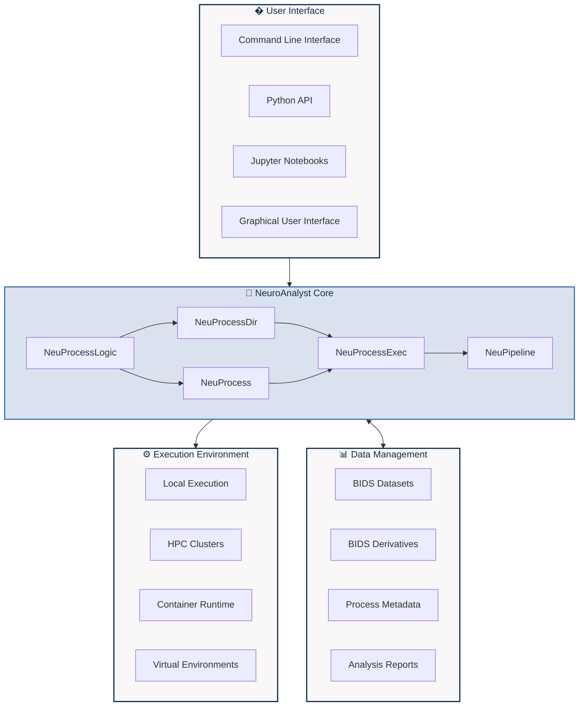

### Component Relationships

| Component | Creates | Depends On | Purpose |
|-----------|---------|------------|---------|
| **NeuProcessLogic** | Python function logic | - | Define computational logic |
| **NeuProcessDir** | Script-based processing | NeuProcessLogic | Generate script directory |
| **NeuProcess** | Container-based processing | NeuProcessLogic | Generate container definition |
| **NeuProcessExec** | Execution environment | NeuProcess or NeuProcessDir | Configure and execute processes |
| **NeuPipeline** | Multi-step workflows | NeuProcessExec | Orchestrate complex pipelines |

### Process Flow

1. **Definition**: Create processing logic using Python functions or NeuProcessLogic
2. **Generation**: Build execution environment with NeuProcessDir or NeuProcess
3. **Configuration**: Set up runtime parameters with NeuProcessExec
4. **Execution**: Run single processes or complete pipelines with dependencies
5. **Collection**: Gather results and metadata for reproducibility

For detailed documentation on each component, see:
- [NeuProcessExec Documentation](docs/neuprocessexec.md)
- [Pipeline Documentation](docs/pipeline.md)

## Advanced Features

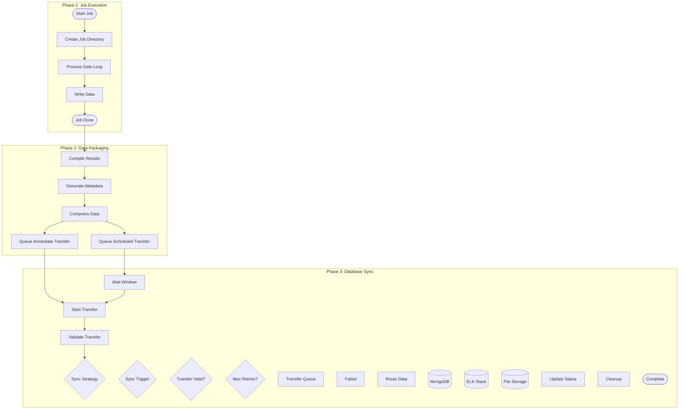

### Data Flow Phases

#### **Phase 1: Job Execution (Compute Node)**
- **Local Storage**: Logs and intermediate results written to temporary job-specific directories
- **Real-time Processing**: Continuous writing during pipeline execution  
- **Isolation**: Each job maintains separate storage space for security and organization
- **Temporary Nature**: Data exists only for the duration of processing + transfer time

#### **Phase 2: Data Packaging (Compute Node)**
- **Result Compilation**: Final logs, metrics, and outputs are packaged together
- **Metadata Generation**: Processing metadata and execution summaries created
- **Transfer Preparation**: Data compressed and queued for database sync
- **Queue Management**: Transfer scheduled based on workload and sync strategy

#### **Phase 3: Database Sync (Database Node)**  
- **Structured Storage**: Different data types routed to appropriate databases
  - **MongoDB**: Pipeline metadata, execution parameters, job configurations
  - **ELK Stack**: Execution logs, performance metrics, error tracking  
  - **File Storage**: Final processing results, intermediate outputs, artifacts
- **Sync Strategies**: 
  - **Ad-hoc (On-demand)**: Immediate transfer for critical jobs
  - **Periodic (Scheduled)**: Batch transfers during low-traffic windows

### Key Design Principles

| Principle | Implementation | Benefit |
|-----------|----------------|---------|
| **No Long-term HPC Storage** | Compute nodes never hold persistent data | Complies with HPC no-daemon constraints |
| **Authoritative Database** | DB node is single source of truth for all results | Ensures data consistency and availability |
| **Flexible Sync Strategy** | Configurable ad-hoc vs. periodic transfers | Tunable per workload requirements |
| **Data Segregation** | Different data types stored in specialized databases | Optimized querying and performance |
| **Fault Tolerance** | Transfer queue with retry mechanisms | Ensures no data loss during sync failures |

### Configuration Options

```python
# Sync strategy configuration
SYNC_CONFIG = {
    "strategy": "periodic",  # or "ad-hoc"
    "interval": "1h",        # for periodic sync
    "batch_size": 100,       # jobs per transfer
    "retry_attempts": 3,     # failed transfer retries
    "compression": True      # compress before transfer
}
```

## Job Submission Workflow

NeuroAnalyst integrates seamlessly with HPC environments through a structured job submission workflow that creates, builds, and executes containerized processing pipelines. The workflow follows a three-step process with comprehensive tracking and steward management.

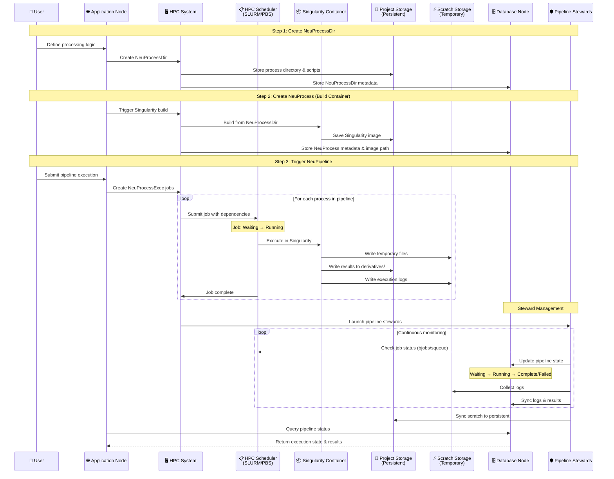

### Workflow Steps

#### **Step 1: Create NeuProcessDir**
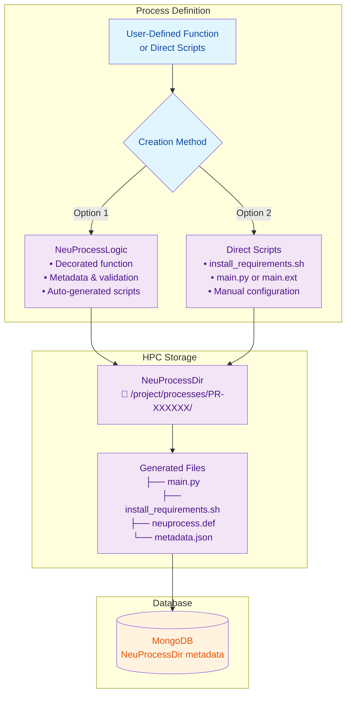

**Storage Locations:**
- **HPC Project Storage**: Persistent process directory with all scripts and configurations
- **MongoDB**: Process metadata, configuration, and tracking information

#### **Step 2: Create NeuProcess (Build Container)**
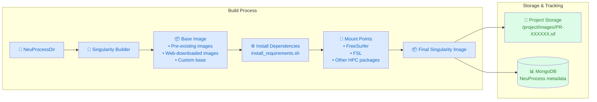

**Key Features:**
- **Optimized Builds**: Leverage existing HPC packages (FreeSurfer, FSL) through mount points
- **Persistent Storage**: Images stored in project storage for reuse
- **Security**: Read-only dataset access, write access only to derivatives directory

#### **Step 3: Trigger NeuPipeline**
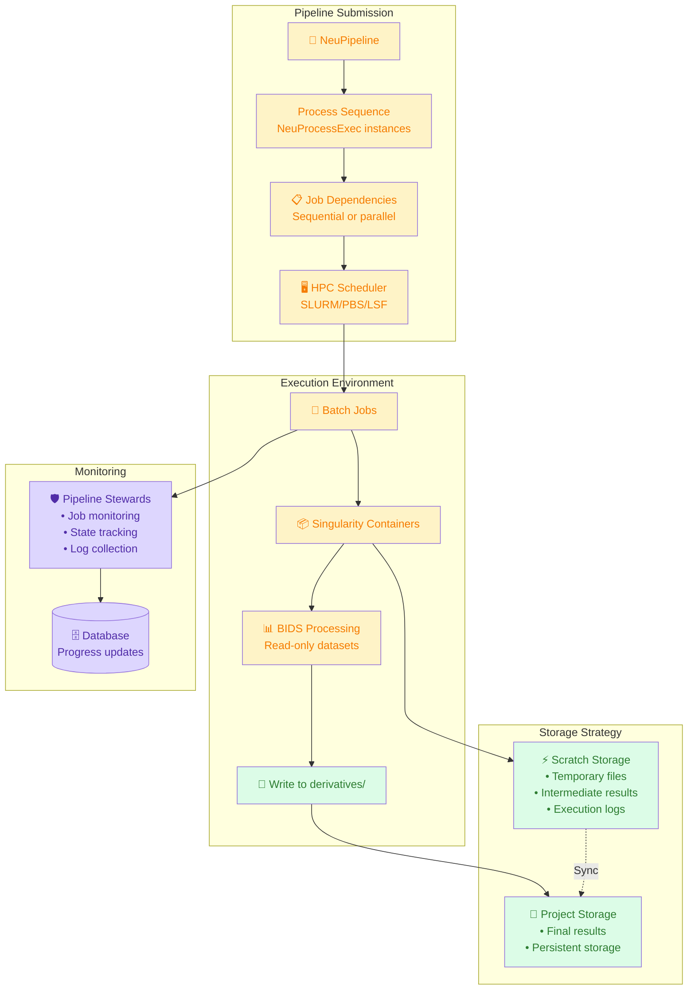

### Storage Architecture

| Storage Type | Purpose | Persistence | Access Pattern |
|--------------|---------|-------------|----------------|
| **Project Storage** | • Process directories<br/>• Singularity images<br/>• Final results | Persistent | • Build-time: Write<br/>• Runtime: Read |
| **Scratch Storage** | • Temporary execution files<br/>• Intermediate results<br/>• Real-time logs | Temporary | • Runtime: Read/Write<br/>• Post-job: Sync to project |
| **BIDS Datasets** | • Input neuroimaging data<br/>• Structured datasets | Persistent | • Runtime: Read-only |
| **Derivatives** | • Pipeline outputs<br/>• Processing results | Persistent | • Runtime: Write<br/>• Query: Read |

### Pipeline Steward System

NeuroAnalyst employs **Pipeline Stewards** - specialized monitoring containers that ensure robust job management:

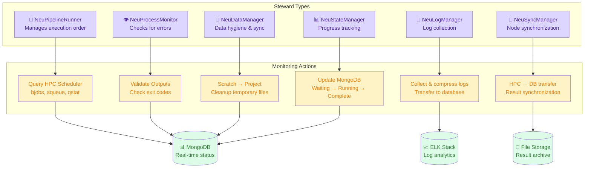

**Steward Characteristics:**
- **Container-based**: Run as Singularity containers in HPC environment
- **No-daemon**: Executed ad-hoc or scheduled via job scheduler
- **Fault-tolerant**: Built-in retry mechanisms and error handling
- **Scalable**: Multiple stewards can run concurrently for large pipelines

### Example Job Submission

```python
from pathlib import Path
from app.models.process.dir.core import NeuProcessDir, NeuProcessDirConfig
from app.models.process.logic.core import NeuProcessLogic, NeuProcessLogicArgument
from app.models.about import About
from app.utils import PATHS, ensure_directories

# Ensure directories exist
ensure_directories()

# Step 1: Create NeuProcessLogic for brain analysis
brain_analysis_logic = NeuProcessLogic(
    about=About(
        name="brain_volume_analysis",
        description="Calculate brain volume from T1w images using nibabel",
        author="NeuroAnalyst Team",
        version="1.0.0"
    ),
    arguments=[
        NeuProcessLogicArgument(
            name="input_filepath",
            type="str",
            description="Path to the input T1w NIfTI file"
        )
    ],
    code='''
import nibabel as nib
import numpy as np
from pathlib import Path

def brain_volume_analysis(input_filepath):
    """Calculate brain volume from T1w image."""
    # Load the T1w image
    img = nib.load(input_filepath)
    data = img.get_fdata()
    
    # Simple brain segmentation (threshold-based)
    brain_mask = data > (np.mean(data) * 0.1)
    brain_volume = np.sum(brain_mask) * np.prod(img.header.get_zooms())
    
    # Calculate additional metrics
    intensity_stats = {
        "mean_intensity": float(np.mean(data[brain_mask])),
        "std_intensity": float(np.std(data[brain_mask])),
        "max_intensity": float(np.max(data[brain_mask]))
    }
    
    return {
        "data": f"Brain volume: {brain_volume:.2f} mm³",
        "description": "Brain volume analysis completed",
        "metadata": {
            "brain_volume_mm3": float(brain_volume),
            "voxel_count": int(np.sum(brain_mask)),
            "voxel_size_mm": list(img.header.get_zooms()[:3]),
            "image_dimensions": list(img.shape),
            "intensity_stats": intensity_stats,
            "processing_method": "Threshold-based segmentation"
        }
    }
''',
    import_statements=[
        "import nibabel as nib", 
        "import numpy as np", 
        "from pathlib import Path"
    ]
)

# Step 2: Create NeuProcessDir with configuration
config = NeuProcessDirConfig(
    python_packages=["nibabel", "numpy", "scipy"],
    parallel_execution=True,
    max_workers=8,
    base_container_image="neurodebian:latest",
    container_mounts=["/apps/freesurfer", "/apps/fsl"]
)

process_dir = NeuProcessDir(
    logic=brain_analysis_logic, 
    config=config
)

# Step 3: Generate the complete directory structure
output_path = process_dir.create_directory(
    PATHS.get_process_workdir(process_dir.process_id)
)

print(f"✅ Created NeuProcessDir: {process_dir.process_id}")
print(f"📁 Directory: {output_path}")
print(f"📋 Generated files:")
print(f"   - main.py (BIDS-compliant processing script)")
print(f"   - install_requirements.sh (dependency installation)")
print(f"   - neuprocess.def (Singularity container definition)")
print(f"   - execute.sh (HPC job submission script)")
print(f"   - README.md (documentation)")

# Note: NeuProcess, NeuPipeline, and HPC scheduler integration
# are currently in development. The above shows the implemented
# functionality for creating complete process directories.
```

> **Implementation Status**: The current codebase implements `NeuProcessLogic`, `NeuProcessDir`, and the decorator pattern shown above. The workflow diagrams below illustrate the complete system architecture, including `NeuProcess`, `NeuPipeline`, and HPC integration components that are planned for future development.

## System Architecture

## Component Architecture & Relationships

The following UML diagrams illustrate the detailed relationships between all the core components we've developed in NeuroAnalyst:

### Core Component Class Diagram

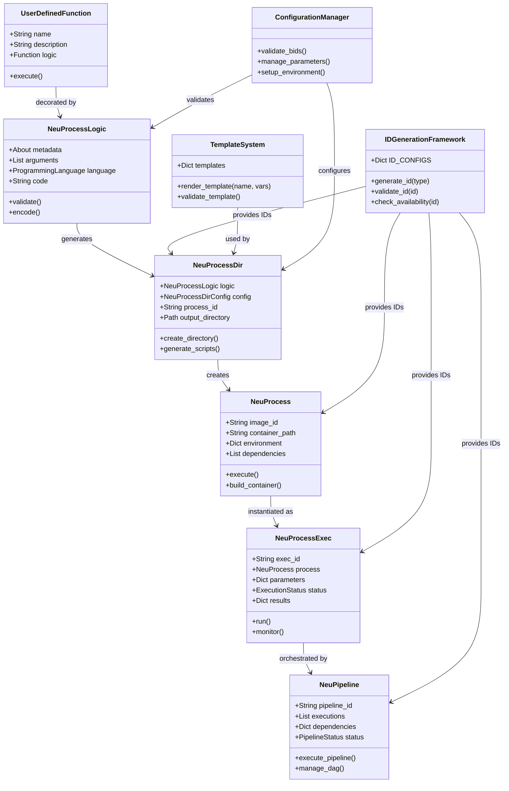

### Component Flow Sequence Diagram

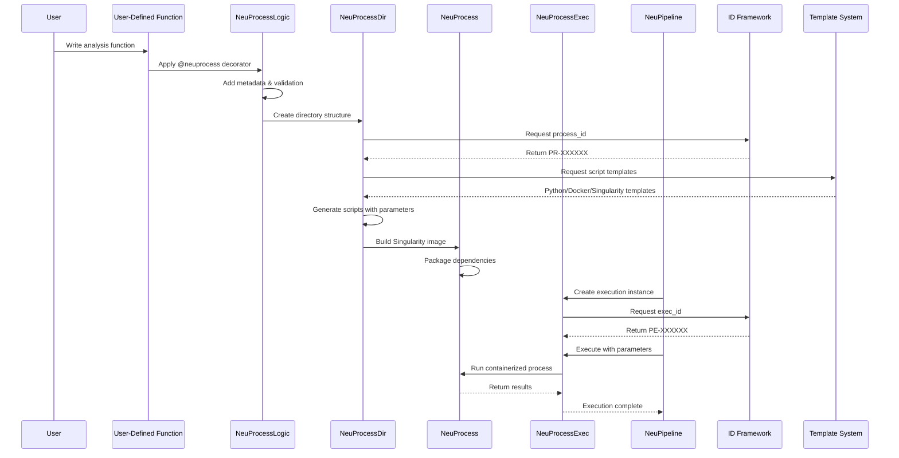

### System Architecture Overview

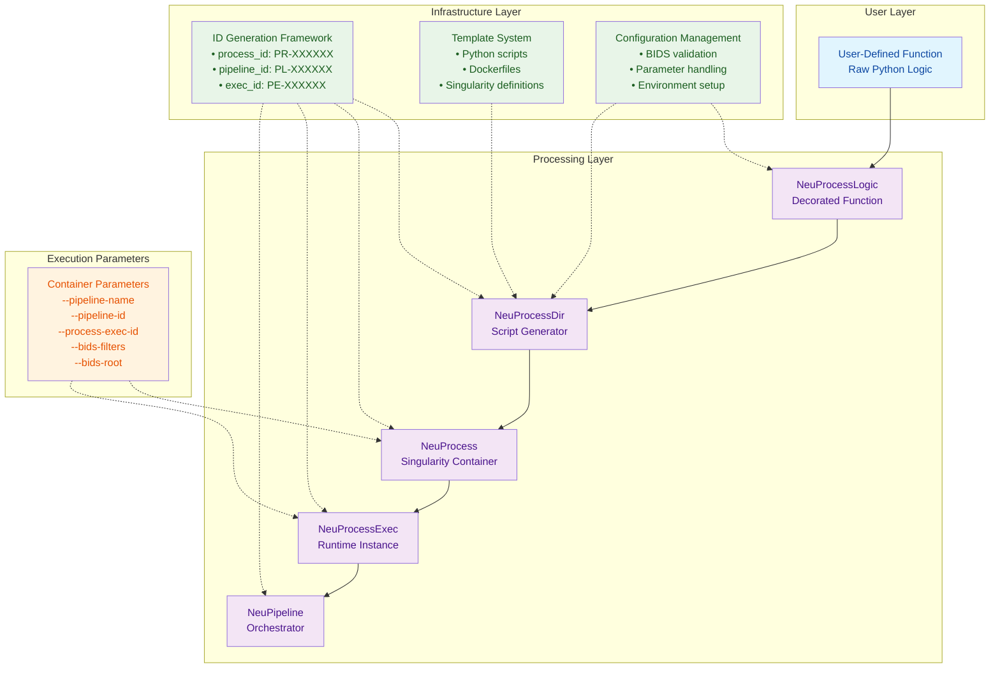

### Component Relationships

#### **Core Processing Flow**
1. **UserDefinedFunction** → **NeuProcessLogic**: Raw functions are decorated with metadata and validation
2. **NeuProcessLogic** → **NeuProcessDir**: Decorated functions generate complete directory structures
3. **NeuProcessDir** → **NeuProcess**: Directory structures become Singularity containers
4. **NeuProcess** → **NeuProcessExec**: Containers are instantiated for specific executions
5. **NeuProcessExec** → **NeuPipeline**: Executions are orchestrated in workflows

#### **Infrastructure Support**
- **ID Generation Framework**: Provides unique identifiers for all components using configurable prefixes
- **Template System**: Standardizes script and container generation with proper parameter handling
- **Configuration Management**: Ensures BIDS compliance and validates execution parameters

#### **Key Features**
- **Generic ID System**: Supports `process_id`, `pipeline_id`, `process_exec_id`, `neuprocess_id`, `neuprocess_exec_id`
- **Corrected Parameters**: All containers use `--pipeline-name`, `--pipeline-id`, `--process-exec-id`, `--bids-filters`, `--bids-root`
- **Template-Based Generation**: Consistent script and container creation across all components

## Architecture

NeuroAnalyst follows a structured component hierarchy that transforms user functions into executable pipelines:

**Core Processing Flow:**
1. **User-Defined Function** → **NeuProcessLogic** (decorator with metadata)
2. **NeuProcessLogic** → **NeuProcessDir** (script and container generation)  
3. **NeuProcessDir** → **NeuProcess** (Singularity containers)
4. **NeuProcess** → **NeuProcessExec** (runtime instances)
5. **NeuProcessExec** → **NeuPipeline** (workflow orchestration)

**Supporting Infrastructure:**
- **ID Generation Framework**: Unified system for unique component identification
- **Template System**: Standardized script and container generation
- **Configuration Management**: BIDS validation and parameter handling

## Processing Types

NeuroAnalyst supports two distinct processing paradigms through `NeuProcessLogic`, each optimized for different types of neuroimaging workflows:

### 🔄 File-Level Processing
Operates on **individual files** within a BIDS dataset, with automatic parallelization and per-file result generation.

**Ideal for:**
- Image preprocessing (skull stripping, normalization, registration)
- File format conversions (DICOM to NIfTI, format standardization)
- Quality control metrics per file
- Feature extraction from individual images
- Any operation that processes files independently

**Key Features:**
- ✅ **Parallel execution** across multiple files
- ✅ **Automatic BIDS path handling** through wrapper decorators
- ✅ **Per-file metadata** and result tracking
- ✅ **Requires `input_filepath` argument** for each file
- 🌍 **Dataset access** via `$BIDS_ROOT` environment variable (optional)

```python
# Example: File-level T1w image normalization
@neuprocess_decorator(config)
def normalize_t1w(input_filepath):
    """Normalize a single T1w image."""
    import os
    from pathlib import Path
    
    # Access the full dataset if needed
    bids_root = Path(os.environ.get('BIDS_ROOT', '.'))
    
    # Process the individual file
    img = nib.load(input_filepath)
    normalized_data = (img.get_fdata() - mean) / std
    
    # Could also access other files in dataset for context
    # layout = BIDSLayout(str(bids_root))
    # related_files = layout.get(subject=subject, session=session)
    
    # Returns: (output_data, metrics, output_entities)
```

### 📊 Bulk Processing  
Operates on the **entire dataset** at once, ideal for aggregation, cross-subject analysis, and dataset-wide operations.

**Ideal for:**
- Dataset-wide statistics and quality control reports
- Group-level analyses and cross-subject comparisons  
- Data aggregation and summarization
- Population studies requiring all subjects
- Any operation needing access to the complete dataset

**Key Features:**
- 🎯 **Single execution** for the entire dataset
- 🌍 **Dataset access** via `$BIDS_ROOT` environment variable
- 📁 **Results saved** to `derivatives/pipeline_name/bulk/`
- 🚫 **No parallel processing** (not applicable)
- ✅ **No specific input arguments** required

```python
# Example: Bulk dataset summary generation
def generate_dataset_summary():
    """Analyze the entire BIDS dataset."""
    bids_root = Path(os.environ['BIDS_ROOT'])
    layout = BIDSLayout(str(bids_root))
    # Process all subjects, generate aggregate metrics
    # Returns: summary_metrics_dict
```

### Choosing the Right Type

| Processing Type | Use When | Example Operations | BIDS Access |
|----------------|----------|-------------------|-------------|
| **File-Level** | Operations are independent per file | T1w preprocessing, format conversion, per-file QC | `input_filepath` + `$BIDS_ROOT` |
| **Bulk** | Need access to multiple/all files simultaneously | Population statistics, group comparisons, dataset QC reports | `$BIDS_ROOT` only |

Both types integrate seamlessly with the NeuroAnalyst containerization and HPC execution framework.

### NeuProcessLogic Processing Types UML Diagram

The following UML class diagram illustrates the two distinct processing paradigms and their implementation:

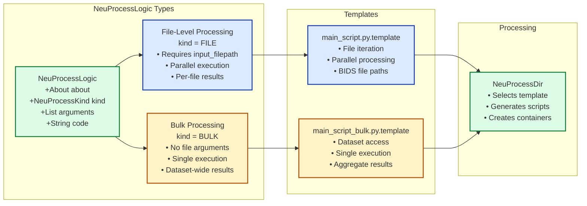
```

### Processing Type Implementation Details

#### **File-Level Processing Implementation**
```python
# Configuration and validation for file-level processing
file_logic = NeuProcessLogic(
    kind=NeuProcessKind.FILE,  # Explicit file-level processing
    arguments=[
        NeuProcessLogicArgument(
            name="input_filepath",  # Required for file-level
            type="str",
            description="Path to individual file"
        )
    ],
    # Parallel execution automatically enabled
    # Template: main_script.py.template
    # Result handling: Per-file metadata and outputs
)
```

#### **Bulk Processing Implementation**  
```python
# Configuration and validation for bulk processing
bulk_logic = NeuProcessLogic(
    kind=NeuProcessKind.BULK,  # Explicit bulk processing
    arguments=[],              # No file-specific arguments
    # Dataset access via $BIDS_ROOT environment variable
    # Template: main_script_bulk.py.template  
    # Result handling: Single aggregated output
)
```

#### **Key Architectural Differences**

| Aspect | File-Level Processing | Bulk Processing |
|--------|----------------------|-----------------|
| **Execution Model** | Parallel across files | Single execution |
| **Template Used** | `main_script.py.template` | `main_script_bulk.py.template` |
| **Arguments Required** | `input_filepath` mandatory | No arguments needed |
| **BIDS Access** | File path + optional `$BIDS_ROOT` | `$BIDS_ROOT` only |
| **Result Structure** | Per-file metadata | Aggregated dataset results |
| **Parallelization** | Automatic via `max_workers` | Not applicable |

## Current Implementation Status

### Core Framework ✅ **Implemented**
- **NeuProcessLogic**: Function decoration with metadata and validation
- **NeuProcessDir**: Complete script and container generation system  
- **NeuProcessExec**: Runtime execution instances with complete HPC integration
- **Generic ID Framework**: Supports `process_id`, `pipeline_id`, `process_exec_id`, `neuprocess_id`, `neuprocess_exec_id`
- **Template System**: Python scripts, Dockerfiles, and Singularity definitions
- **BIDS Integration**: PyBIDS-based validation and path construction

### Container Parameters ✅ **Corrected**
All generated containers use the standardized parameter set:
- `--pipeline-name`: Processing pipeline identifier
- `--pipeline-id`: Unique pipeline ID  
- `--process-exec-id`: Execution instance ID
- `--bids-filters`: Dataset filtering criteria
- `--bids-root`: BIDS dataset root directory

### In Development 🚧
- **NeuProcess**: Singularity container management and execution
- **NeuPipeline**: Multi-process workflow orchestration and DAG management

### ✅ **Recently Implemented**
- **NeuProcessExec**: Runtime execution instances with complete parameter tracking and HPC integration
  - Script-based and container-based execution modes
  - SLURM and PBS job script generation
  - Execution state management and monitoring
  - Environment variable and resource configuration
  - Command generation for both development and production use

### Future Development 📋
- **Enhanced TUI**: Form-based input and interactive pipeline visualization
- **Insight API**: LLM-powered knowledge discovery and result contextualization
- **HPC Integration**: Advanced job scheduling and resource management
- **Collaborative Features**: Pipeline sharing and version control

## Documentation

Comprehensive documentation is available in the `docs/` directory:

### Core Documentation
- **[Template System](docs/TEMPLATE_SYSTEM.md)** - Complete template architecture, cleanup history, and usage guide
- **[Development History](docs/DEVELOPMENT_HISTORY.md)** - Framework evolution, major milestones, and architectural decisions
- **[Constants Guide](docs/CONSTANTS_GUIDE.md)** - Environment setup and configuration management
- **[Constants Integration](docs/CONSTANTS_INTEGRATION_SUMMARY.md)** - Implementation details of the centralized config system

### Implementation Details
- **[PyBIDS Removal Summary](docs/PYBIDS_REMOVAL_SUMMARY.md)** - Simplification of PyBIDS integration and fallback removal
- **[Self-Contained Success](docs/SELF_CONTAINED_SUCCESS_SUMMARY.md)** - Migration from dependency-heavy to standalone script generation

### Quick References
- **Template Structure**: 6 active templates for different processing types
- **Processing Modes**: File-level (parallel/sequential) and bulk processing
- **Function Definition**: Two flexible approaches for UDF integration
- **BIDS Compliance**: Native PyBIDS integration with automatic metadata

## Examples

Working examples are available in:
- `app/models/process/wrapper/examples/` - Decorator usage examples
- `app/models/process/wrapper/tests/` - Integration tests
- `app/models/process/dir/tests/` - Directory generation tests
- `example_bulk_vs_file_processing.py` - Comprehensive comparison of file-level vs bulk processing
- `test_bulk_processing.py` - Test implementation showing both processing types

## What Makes NeuroAnalyst Different

### 1. Function-Centric Development
Transform Python functions directly into complete processing pipelines without complex container definitions or deployment scripts.

### 2. BIDS-First Architecture  
Built-in BIDS compliance ensures datasets are structured correctly and metadata is preserved throughout processing.

### 3. Generic Infrastructure
Unified ID generation, template system, and configuration management support any neuroimaging workflow.

### 4. Container-Ready Output
Automatic generation of Singularity containers optimized for HPC environments with proper security controls.

### 5. Metadata Preservation
## Advanced Features

### Bulk Processing

NeuroAnalyst supports dataset-wide processing with the `BULK` processing kind:

```python
bulk_logic = NeuProcessLogic(
    about=About(
        name="dataset_summary",
        description="Generate dataset-wide statistics",
        author="Your Name",
        version="1.0.0"
    ),
    kind=NeuProcessKind.BULK,  # Enable dataset-wide processing
    code='''
import os
from pathlib import Path
from bids import BIDSLayout

def dataset_summary():
    """Generate dataset-wide summary statistics."""
    bids_root = Path(os.environ.get('BIDS_ROOT', '.'))
    layout = BIDSLayout(str(bids_root), validate=False)
    
    subjects = layout.get_subjects()
    sessions = layout.get_sessions()
    
    return {
        "total_subjects": len(subjects),
        "total_sessions": len(sessions) if sessions else 0,
        "total_files": len(layout.get()),
        "t1w_count": len(layout.get(suffix='T1w')),
        "bold_count": len(layout.get(suffix='bold'))
    }
''',
    import_statements=["import os", "from pathlib import Path", "from bids import BIDSLayout"]
)
```

### Parallel Processing

For file-level processing, NeuroAnalyst can automatically parallelize execution:

```python
file_config = NeuProcessDirConfig(
    python_packages=["nibabel", "numpy"],
    parallel_execution=True,  # Enable parallel processing
    max_workers=4             # Limit concurrent processes
)
```

### Custom HPC Resource Configurations

Fine-tune HPC resource allocation for your processing needs:

```python
hpc_script = process_exec.generate_hpc_script(
    job_name="volume_analysis",
    scheduler=HPCScheduler.SLURM,
    partition="compute",
    account="neuro_lab",
    memory="16GB",
    cpu_count=4,
    time_limit="02:00:00",
    queue="normal",
    additional_directives=[
        "#SBATCH --mail-type=ALL",
        "#SBATCH --mail-user=user@example.com"
    ]
)
```

## Contributing

We welcome contributions to NeuroAnalyst! Here's how you can help:

1. **Report bugs** by opening an issue
2. **Request features** through the issue tracker
3. **Submit pull requests** with improvements or bug fixes
4. **Improve documentation** by fixing errors or adding examples
5. **Share your use cases** to help others learn

### Development Setup

```bash
# Clone the repository
git clone https://github.com/chinmaymokashicm/neuroanalyst.git
cd neuroanalyst

# Create a development environment
python -m venv venv
source venv/bin/activate  # On Windows: venv\Scripts\activate

# Install dependencies for development
pip install -e ".[dev]"

# Run tests
pytest
```

## License

This project is licensed under the MIT License - see the LICENSE file for details.

## Citation

If you use NeuroAnalyst in your research, please cite:

```
Mokashi, C. (2023). NeuroAnalyst: A Framework for Standardized Neuroimaging Workflows.
GitHub repository: https://github.com/chinmaymokashicm/neuroanalyst
```
Rich metadata flows through the entire processing chain, enabling reproducibility and provenance tracking.
Rich metadata flows through the entire processing chain, enabling reproducibility and provenance tracking.

## Advanced Features

### Bulk Processing

NeuroAnalyst supports dataset-wide processing with the `BULK` processing kind:

```python
bulk_logic = NeuProcessLogic(
    about=About(
        name="dataset_summary",
        description="Generate dataset-wide statistics",
        author="Your Name",
        version="1.0.0"
    ),
    kind=NeuProcessKind.BULK,  # Enable dataset-wide processing
    code="""
import os
from pathlib import Path
from bids import BIDSLayout

def dataset_summary():
    """Generate dataset-wide summary statistics."""
    bids_root = Path(os.environ.get("BIDS_ROOT", "."))
    layout = BIDSLayout(str(bids_root), validate=False)
    
    subjects = layout.get_subjects()
    sessions = layout.get_sessions()
    
    return {
        "total_subjects": len(subjects),
        "total_sessions": len(sessions) if sessions else 0,
        "total_files": len(layout.get()),
        "t1w_count": len(layout.get(suffix="T1w")),
        "bold_count": len(layout.get(suffix="bold"))
    }
""",
    import_statements=["import os", "from pathlib import Path", "from bids import BIDSLayout"]
)
```

### Parallel Processing

For file-level processing, NeuroAnalyst can automatically parallelize execution:

```python
file_config = NeuProcessDirConfig(
    python_packages=["nibabel", "numpy"],
    parallel_execution=True,  # Enable parallel processing
    max_workers=4             # Limit concurrent processes
)
```

### Custom HPC Resource Configurations

Fine-tune HPC resource allocation for your processing needs:

```python
hpc_script = process_exec.generate_hpc_script(
    job_name="volume_analysis",
    scheduler=HPCScheduler.SLURM,
    partition="compute",
    account="neuro_lab",
    memory="16GB",
    cpu_count=4,
    time_limit="02:00:00",
    queue="normal",
    additional_directives=[
        "#SBATCH --mail-type=ALL",
        "#SBATCH --mail-user=user@example.com"
    ]
)
```

## Contributing

We welcome contributions to NeuroAnalyst! Here is how you can help:

1. **Report bugs** by opening an issue
2. **Request features** through the issue tracker
3. **Submit pull requests** with improvements or bug fixes
4. **Improve documentation** by fixing errors or adding examples
5. **Share your use cases** to help others learn

### Development Setup

```bash
# Clone the repository
git clone https://github.com/chinmaymokashicm/neuroanalyst.git
cd neuroanalyst

# Create a development environment
python -m venv venv
source venv/bin/activate  # On Windows: venv\Scriptsctivate

# Install dependencies for development
pip install -e ".[dev]"

# Run tests
pytest
```

## License

This project is licensed under the MIT License - see the LICENSE file for details.

<!-- ## Citation

If you use NeuroAnalyst in your research, please cite:

```
Mokashi, C. (2023). NeuroAnalyst: A Framework for Standardized Neuroimaging Workflows.
GitHub repository: https://github.com/chinmaymokashicm/neuroanalyst
``` -->