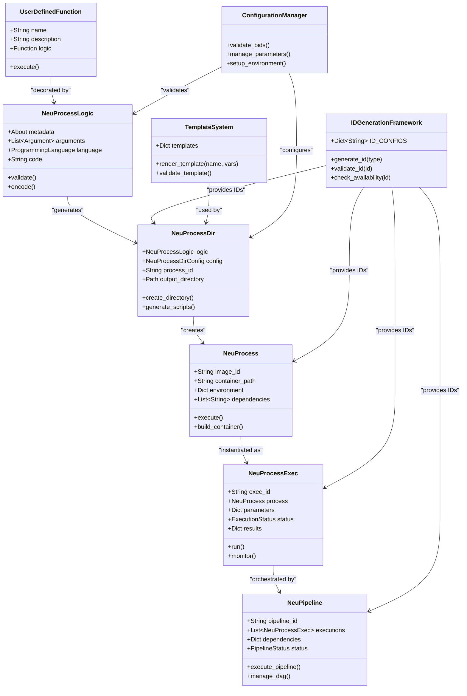
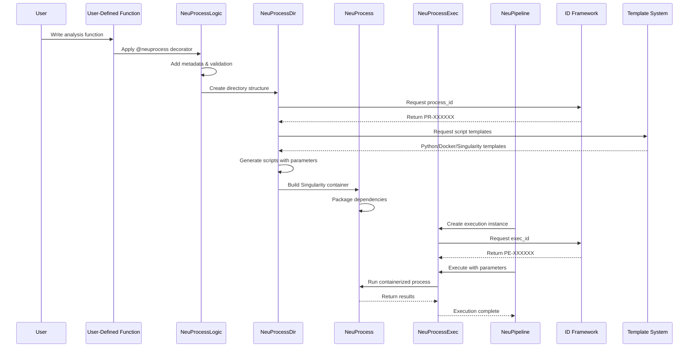
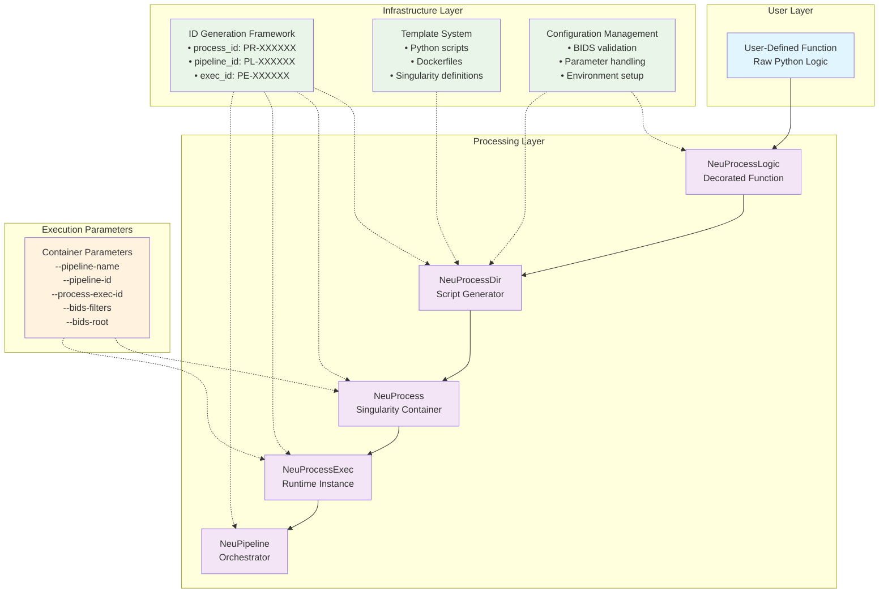

# NeuroAnalyst

NeuroAnalyst is a comprehensive framework for standardizing and automating neuroimaging data processing workflows. It transforms Python functions into complete, BIDS-compliant processing pipelines with containerized execution and rich metadata management.

## Key Features

- **Function-to-Pipeline**: Convert Python functions into complete processing workflows
- **BIDS Compliance**: Automatic dataset validation and metadata generation  
- **Containerization**: Generate Singularity containers with all dependencies
- **Generic ID Framework**: Unified identification system across all components
- **Template-Based Generation**: Standardized script and container creation
- **HPC Integration**: Optimized for high-performance computing environments

## Quick Start

### Environment Setup

First, set up the NeuroAnalyst environment:

```bash
# Clone the repository
git clone https://github.com/chinmaymokashicm/neuroanalyst.git
cd neuroanalyst

# Run setup script (creates virtual environment, installs dependencies, sets environment variables)
source setup.sh
```

This creates the following directory structure:

```
~/neuroanalyst/
├── apptainer/images/      # Singularity images (base, processes, pipelines)
├── working_dirs/          # Temporary processing directories
├── reports/              # Generated reports and outputs
├── logs/                 # Framework log files
└── datasets/             # BIDS datasets and derivatives
```

### Basic Usage

```python
from app.utils import PATHS, CONFIG, ensure_directories
from app.models.process.wrapper import neuprocess, NeuProcessDecoratorConfig
from app.models.process.dir.core import NeuProcessDir, NeuProcessDirConfig
from app.models.process.logic.core import NeuProcessLogic
from app.models.about import About

# Ensure all directories are set up
ensure_directories()

# 1. Define your analysis function
def brain_volume_analysis(input_file, output_dir):
    """Calculate brain volume from structural MRI."""
    # Your analysis logic here
    return results

# 2. Create NeuProcessLogic with metadata
logic = NeuProcessLogic(
    about=About(
        name="brain_volume_analysis",
        description="Brain volume calculation pipeline",
        author="Your Name"
    ),
    arguments=[],  # Define arguments as needed
    code="# Your function code here"
)

# 3. Generate complete directory structure
config = NeuProcessDirConfig()
neuprocess_dir = NeuProcessDir(logic=logic, config=config)

# 4. Create scripts and containers using the configured paths
output_path = neuprocess_dir.create_directory(PATHS.get_process_workdir("my_process"))
```

This generates:
- `main.py`: BIDS-compliant processing script
- `neuprocess.def`: Singularity container definition  
- `execute.sh`: HPC job submission script
- Complete documentation and metadata

For detailed information about paths and configuration, see [Constants Guide](docs/CONSTANTS_GUIDE.md).

## Component Architecture & Relationships

The following UML diagrams illustrate the detailed relationships between all the core components we've developed in NeuroAnalyst:

### Core Component Class Diagram



### Component Flow Sequence Diagram



### System Architecture Overview



### Component Relationships

#### **Core Processing Flow**
1. **UserDefinedFunction** → **NeuProcessLogic**: Raw functions are decorated with metadata and validation
2. **NeuProcessLogic** → **NeuProcessDir**: Decorated functions generate complete directory structures
3. **NeuProcessDir** → **NeuProcess**: Directory structures become Singularity containers
4. **NeuProcess** → **NeuProcessExec**: Containers are instantiated for specific executions
5. **NeuProcessExec** → **NeuPipeline**: Executions are orchestrated in workflows

#### **Infrastructure Support**
- **ID Generation Framework**: Provides unique identifiers for all components using configurable prefixes
- **Template System**: Standardizes script and container generation with proper parameter handling
- **Configuration Management**: Ensures BIDS compliance and validates execution parameters

#### **Key Features**
- **Generic ID System**: Supports `process_id`, `pipeline_id`, `process_exec_id`, `neuprocess_id`, `neuprocess_exec_id`
- **Corrected Parameters**: All containers use `--pipeline-name`, `--pipeline-id`, `--process-exec-id`, `--bids-filters`, `--bids-root`
- **Template-Based Generation**: Consistent script and container creation across all components
- **Metadata Preservation**: Rich metadata flows through the entire processing chain

## Architecture

NeuroAnalyst follows a structured component hierarchy that transforms user functions into executable pipelines:

**Core Processing Flow:**
1. **User-Defined Function** → **NeuProcessLogic** (decorator with metadata)
2. **NeuProcessLogic** → **NeuProcessDir** (script and container generation)  
3. **NeuProcessDir** → **NeuProcess** (Singularity containers)
4. **NeuProcess** → **NeuProcessExec** (runtime instances)
5. **NeuProcessExec** → **NeuPipeline** (workflow orchestration)

**Supporting Infrastructure:**
- **ID Generation Framework**: Unified system for unique component identification
- **Template System**: Standardized script and container generation
- **Configuration Management**: BIDS validation and parameter handling

## Current Implementation Status

### Core Framework ✅ **Implemented**
- **NeuProcessLogic**: Function decoration with metadata and validation
- **NeuProcessDir**: Complete script and container generation system  
- **Generic ID Framework**: Supports `process_id`, `pipeline_id`, `process_exec_id`, `neuprocess_id`, `neuprocess_exec_id`
- **Template System**: Python scripts, Dockerfiles, and Singularity definitions
- **BIDS Integration**: PyBIDS-based validation and path construction

### Container Parameters ✅ **Corrected**
All generated containers use the standardized parameter set:
- `--pipeline-name`: Processing pipeline identifier
- `--pipeline-id`: Unique pipeline ID  
- `--process-exec-id`: Execution instance ID
- `--bids-filters`: Dataset filtering criteria
- `--bids-root`: BIDS dataset root directory

### In Development 🚧
- **NeuProcess**: Singularity container management and execution
- **NeuPipeline**: Multi-process workflow orchestration and DAG management
- **NeuProcessExec**: Runtime execution instances with parameter tracking

### Future Development 📋
- **Enhanced TUI**: Form-based input and interactive pipeline visualization
- **Insight API**: LLM-powered knowledge discovery and result contextualization
- **HPC Integration**: Advanced job scheduling and resource management
- **Collaborative Features**: Pipeline sharing and version control

## Examples

Working examples are available in:
- `app/models/process/wrapper/examples/` - Decorator usage examples
- `app/models/process/wrapper/tests/` - Integration tests
- `app/models/process/dir/tests/` - Directory generation tests

## What Makes NeuroAnalyst Different

### 1. Function-Centric Development
Transform Python functions directly into complete processing pipelines without complex container definitions or deployment scripts.

### 2. BIDS-First Architecture  
Built-in BIDS compliance ensures datasets are structured correctly and metadata is preserved throughout processing.

### 3. Generic Infrastructure
Unified ID generation, template system, and configuration management support any neuroimaging workflow.

### 4. Container-Ready Output
Automatic generation of Singularity containers optimized for HPC environments with proper security controls.

### 5. Metadata Preservation
Rich metadata flows through the entire processing chain, enabling reproducibility and provenance tracking.