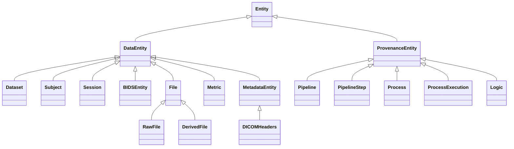

# IntelliBIDS: From Python Functions to AI-Ready Neuroscience Workflows

```
Approach:
- Focus on standardized analysis research infrastructure, provenance as a first-class citizen, AI-ready data resources
- Knowledge graphs are nice to have and point towards future directions, but for the scope of this paper, they are just for visualization
- Acknowledge related work in this space but do not be overtly critical, or oversell IntelliBIDS in comparison

Instructions:
- Verify the references in the Introduction section VERY carefully
- Do not make over-the-top or too-precise-to-be-verified claims
- Keep Introduction simple. Avoid focusing on detailed numbers unless the referenced papers state them explicitly
- Analyze the narrative flow of the paper
```


## 1. Abstract

## 2. Introduction
### 2.1 Reproducibility Crisis in Neuroimaging: Root Causes and Manifestations
#### 2.1.1 Diversity of Analytic Approaches Drives Irreproducibility
- *Pipeline variability inflates findings*: The NARPS study asked 70 independent research teams to analyze the same fMRI dataset against nine pre-specified hypotheses and found substantial disagreement in reported results despite high similarity in intermediate activation maps, demonstrating that analytic flexibility—not data quality—is a primary driver of non-reproducibility.​ [Botvinik-Nezer R et al. 2020]

- *Extreme analytic flexibility in fMRI analysis*: Systematic enumeration of fMRI preprocessing and statistical choices revealed 6,912 distinct analysis pipelines for a single dataset; combined with five multiple-comparison correction methods, this yielded 34,560 thresholded activation maps, with a median analytic Z-value range of 3.44 across voxels, meaning that voxels showing strong activation under some pipelines could be null under others.​ [Carp 2012]

- *Diffusion tensor imaging is vulnerable to scanner and protocol variation*: Fractional anisotropy (FA) and related DTI metrics show significant variability across scanners and acquisition protocols, with inter-scanner differences and the number of diffusion-encoding directions (e.g., 12 vs. 64) producing changes in FA comparable to those reported between clinical and control groups, complicating interpretation of diffusion-based biomarkers.​ [Provenzale, James M et al. 2018]

- *Cross-pipeline methodological heterogeneity*: Comparisons of commonly used preprocessing pipelines (e.g., FSL-, SPM-, AFNI-based workflows and modern standardized pipelines) show that conceptually similar operations can yield only moderate agreement in derived connectivity measures, indicating that no single pipeline is uniformly dominant and that unreported low-level choices materially affect results.​ [Kiar et al. 2024]

- *Structural MRI measurements show region-dependent reproducibility*: Test–retest studies of T1-weighted structural MRI report excellent intra-class correlation coefficients (ICCs) for many cortical and subcortical measures, but moderate-to-low reproducibility for cortical thickness in regions such as entorhinal, insula, and medial orbitofrontal cortex, highlighting that morphometric reliability is both region- and pipeline-dependent.​ [McGuire, Stephen A et al. 2017]

- *Downstream analytic decisions introduce multiplicative uncertainty*: Choices made after preprocessing—such as parcellation scheme, statistical thresholding strategy, and connectivity model—can have effects on network-level metrics that rival or exceed those of the preprocessing pipeline itself, implying that entire analytic decision trees, not just pipeline selection, must be considered when assessing reproducibility.​ [Carp 2012, Kiar et al. 2024]

- *Structural preprocessing choices systematically alter morphometry*: Different parameter settings within widely used structural pipelines (such as FreeSurfer) and choices between unimodal versus multimodal preprocessing produce systematic differences in derived cortical thickness, surface area, and volume estimates across broad regions, indicating that even “standard” pipelines embed substantial analytic flexibility.​ [Zhang, L. et al. 2023]

- *Preprocessing interactions in multi-modal pipelines*: When structural and functional MRI are combined in joint pipelines, decisions in one modality (such as structural normalization templates or surface reconstruction parameters) propagate into functional analyses and can materially alter connectivity estimates and network metrics, so reproducibility must be evaluated at the level of the full multi-modal workflow rather than isolated steps.​ [Zhang, L. et al. 2023]

- *Stochastic algorithms and hidden randomness*: Many core operations in fMRI, structural MRI, and DTI preprocessing (nonlinear registration, ICA-based denoising, deep learning–based segmentation) rely on iterative optimization with random initialization; without explicit control of random seeds and detailed provenance, runs with identical data and code can yield measurably different outputs.​ [Kiar et al. 2024, Carp 2012]

- *Template, atlas, and parameter choices as silent dependencies*: Choices of anatomical template (e.g., different MNI152 versions), parcellation atlas, and “minor” numerical parameters (e.g., convergence thresholds, smoothing kernels) are often underreported but have been shown to reduce individual-level correspondence (e.g., correlations below 0.8 between templates) and to shift derived features in ways comparable to or larger than biological effects of interest, making these silent dependencies critical contributors to irreproducibility. [Gilmore, Alysha D et al. 2021]

#### 2.1.2 Systematic Sources of Non-Reproducibility
- *Undisclosed analytic flexibility & researcher degrees of freedom*: Low statistical power, p-hacking, hypothesizing after results are known (HARKing), and publication bias systematically distort findings; compounded by lack of pre-registration and open-ended parameter search spaces; when analytic flexibility is high and different methods yield different results, researchers may selectively report favorable methods and omit null results, inflating false positive rates [Munafò et al. 2017, Bishop 2019]

- *Absence of ground truth in brain imaging*: Neuroscience lacks accessible ground truths, leading to abundance of equally-plausible approaches for generating derived measures (e.g., 768 distinct fMRI preprocessing pipeline combinations tested systematically); each approach contains undefined amounts of uncertainty; this stands in contrast to fields with clear gold standards, allowing validation against known outcomes [Klapwijk et al. 2024]

- *Stochastic variability in algorithm initialization*: Iterative optimization algorithms (ICA, deep learning, nonlinear registration) depend on random initialization; FreeSurfer and other tools implement partial solutions (variable random seed) inconsistently, and many tools lack any control over this source of instability; this stochastic variability propagates through pipelines and affects reproducibility even when code and data are identical [Adali & Calhoun 2022]

- *Data-preprocessing-analysis coupling affects generalization*: Only 9% of deep-learning studies in medical image segmentation and 12/154 DL-EEG papers were fully reproducible; minimal changes in preprocessing parameters (IClabel thresholds, ANTs convergence tolerance) drastically alter downstream analysis results; when homogeneous datasets are used for validation, cross-validation procedures yield high prediction accuracies but biased biomarkers with poor generalization to new or future cohorts [Renard et al. 2020; Roy et al. 2019]

#### 2.1.3 Consequences of Non-Reproducibility
- *Replication failure undermines scientific validity*: A survey of 1,576 researchers reported that 83% agreed there is a reproducibility crisis in science and 52% considered it “significant,” underscoring widespread concern about the credibility of published findings [Baker, 2016]. In parallel, large-scale replication projects in other fields have shown that only about one-third of attempted replications reproduce originally reported statistically significant effects, highlighting how fragile many published results are in practice [Cobey et al., 2024].

- *Hidden sources of variability prevent best-practice identification*: Without end-to-end provenance for computational workflows, it is impossible to systematically determine which configuration choices, software versions, or parameter settings drive observed results, which in turn blocks principled evaluation of alternative analysis strategies [Poldrack & Gorgolewski, 2014]. Work on reproducible neuroimaging has emphasized that capturing and querying computational lineage is essential for understanding how different pipelines affect conclusions and for moving from ad hoc scripts toward transparent, auditable workflows [Poldrack et al., 2019].

- *Misaligned inferences when moving between tools:* Comparative studies demonstrate that differences between preprocessing and analysis tools can significantly influence derived imaging features and downstream results. For example, structural MRI cortical thickness measures show *poor ROI-wise agreement across different software (e.g., ANTS, CIVET, FreeSurfer)*, highlighting substantial variability introduced by pipeline choice that can affect interpretations of individual- or group-level effects. Moreover, in *task-free analyses*, low-dimensional embeddings (e.g., t-SNE) of individual feature sets reveal *stronger similarity within the same preprocessing tool than across different tools*, with clustering patterns reflecting tool choice more than diagnostic group distinctions. These findings imply that conclusions about biological or clinical patterns can be driven in part by methodological differences rather than underlying neurobiology alone. *[Bhagwat et al., 2021: *Understanding the impact of preprocessing pipelines on neuroimaging cortical surface analyses*, GigaScience]*

- *Large-scale bias when preprocessed features are shared*: As large open datasets increasingly distribute preprocessed derivatives—such as cortical thickness maps, volumetric measures, or connectomes—tool- and pipeline-specific idiosyncrasies are implicitly baked into downstream analyses yet rarely quantified [Poldrack et al., 2019]. When these derivatives are reused across sites for meta-analyses or machine learning, uncharacterized biases in feature estimation can propagate through the literature and hinder cross-cohort generalization, especially when different groups adopt different “standard” pipelines [Botvinik-Nezer et al., 2020; Klapwijk et al., 2024].

- *Regulatory and clinical translation roadblocks*: FDA guidance on clinical trial imaging endpoints stresses standardized acquisition protocols, image interpretation procedures, and quality control, and expects sponsors to document the entire image handling and analysis process in a manner suitable for audit [FDA, 2020, *Clinical Trial Imaging Endpoint Process Standards Guidance for Industry*]. Without detailed provenance records tying each derived endpoint to specific software versions, parameters, and workflows, imaging-based biomarkers cannot be robustly validated or de-risked for regulatory decision-making, making traceability a prerequisite for clinical translation rather than an optional best practice [FDA, 2020].

### 2.2 Data as the Bottleneck for AI/ML in Neuroimaging
#### 2.2.1 Data Quality Heterogeneity and Cross-Site Variability
- *Multi-site acquisition effects confound learning*: Large-sample brain-wide association studies combining the Adolescent Brain Cognitive Development study (ABCD, n=11,874), Human Connectome Project (HCP, n=1,200), and UK Biobank (UKB, n=35,735) demonstrated that data heterogeneity arising from different scanner manufacturers, field strengths, and acquisition protocols creates systematic variations that confound learning; across sites, scanner types, and pulse sequences, effect size distributions were remarkably consistent (suggesting universal challenges), yet within-site single-scanner samples showed equivalent or lower sampling variability only after explicit cross-site harmonization was applied, indicating that scanner and site effects are quantifiable and substantial [Marek et al., 2022].

- *Harmonization tools alone are insufficient without provenance*: ComBat, a batch-effect correction tool adapted from genomics to neuroimaging, effectively mitigates cross-site variability in DTI [Fortin et al., 2017] and cortical thickness measures [Fortin et al., 2018] while preserving biological associations; however, ComBat requires prior knowledge of which scans belong to which site and implicitly assumes that site/scanner effects are the only sources of unwanted variation that need correction. Without structured provenance explicitly documenting acquisition site, scanner model, and processing parameters, researchers cannot systematically determine which harmonization strategy is most appropriate, whether harmonization was correctly applied, or whether residual biases remain; furthermore, choosing different reference sites for harmonization normalization produces different results, making transparent documentation of harmonization choices essential for reproducibility.

- *Undocumented dependencies on scanner and template versions:* Template selection (e.g., different MNI152 versions), brain extraction and segmentation tools (e.g., FreeSurfer version), and preprocessing software (e.g., FSL version) are frequently underreported in published methods sections, obscuring potential sources of variability and preventing systematic assessment of whether findings are robust to tool updates or versions. Comparative studies of minimal fMRI preprocessing pipelines handling identical raw data show that decisions as seemingly minor as the *choice of MNI standard-space version and output resolution can substantially reduce inter-pipeline agreement*, indicating that such infrastructure choices have material effects on derived features and downstream conclusions (e.g., inter-pipeline agreement limits observed across different normalization configurations). [Li, Ai, et al. (2024) - *Moving beyond processing- and analysis-related variation in resting-state functional brain imaging*]

#### 2.2.2 Metadata Inconsistency and Provenance Fragmentation
- *Absence of standardized metadata representation*: Crucial provenance information (preprocessing parameters, tool versions, execution timestamps, container hashes, quality-control metrics) is often scattered across DICOM headers, laboratory notebooks, ad hoc spreadsheets, and informal documentation, making sharing and reuse of data “difficult if not impossible” and complicating the application of automatic pipelines and quality assurance procedures [Gorgolewski et al., 2016]. This fragmentation forces machine learning teams to implement custom, institution-specific curation pipelines that are labor-intensive, error-prone, and difficult to reproduce across sites [Gorgolewski et al., 2016].

- *Inability to query processing history:* Most current neuroimaging repositories and workflow frameworks do not natively support **rich, structured queries about preprocessing history or specific software versions used**. Information such as which subjects were preprocessed with particular software versions, or which passed specified quality thresholds, is typically not stored in a standardized, machine-queryable way. This **lack of accessible provenance and processing metadata** hinders systematic evaluation of how preprocessing choices influence downstream results and prevents reproducible stratification of datasets by processing parameters or QC outcomes. Community recommendations and frameworks emphasize tracking provenance and workflow details to improve reproducibility, but implementation remains uneven across studies and repositories (e.g., Poldrack, R. A., Gorgolewski, K. J., & Varoquaux, G. *Computational and informatic advances for reproducible data analysis in neuroimaging.* *Ann. Rev. Biomed. Data Sci.* 2, 119–138 (2019); Poldrack & Gorgolewski, 2024). ([SSRN][3])

- *Quality-control metrics rarely captured systematically:* While many preprocessing tools compute QC metrics (e.g., motion parameters, brain volume estimates, signal–to–noise ratios), these quality indicators are **often stored in disparate formats or remain embedded in individual preprocessing outputs**, rather than being aggregated into a common, queryable structure across projects or repositories. As a consequence, it is difficult to perform large-scale automated screening of dataset quality, identify acquisition or preprocessing anomalies at scale, or track quality trends across cohorts. Community standards such as BIDS and associated QC tools (e.g., MRIQC) clearly advocate for systematic capture of QC metadata to enable reuse, but consistent aggregation and discoverability of QC indicators remain aspirational for much of the field (e.g., Gorgolewski et al., 2016; Poldrack et al., 2019). ([Data Science Journal][1])

#### 2.2.3 Knowledge Representation Gaps
- *Imaging metrics lack machine-actionable semantic links:* Quantitative neuroimaging features (e.g., cortical thickness, regional volumes, connectivity measures) are usually represented as numerical arrays or tabular data with minimal explicit links to standardized biomedical concepts (such as clinical phenotypes, anatomical ontologies, or disease processes). Without formal, **machine-readable semantic annotations** — e.g., ontological identifiers, controlled vocabularies, or linked biomedical knowledge graphs — it is difficult for downstream analytic models to **integrate neuroimaging measures with broader biomedical knowledge** for tasks like feature enrichment, knowledge-guided regularization, or mechanistic hypothesis testing. This gap reflects a broader challenge in biomedical data integration: *data structures and terminologies are often disconnected from formal semantic representations*, limiting computational interoperability and knowledge discovery across heterogeneous sources. Structured ontologies and semantic data models are proposed as means to bridge this gap and support richer, machine-actionable integration of biomedical data. (["Towards an ontology for sharing medical images and regions of interest in neuroimaging - PubMed"]["Benchmarking Ontologies: Bigger or Better? - Research journals"])

- *Scattered domain knowledge prevents systematic synthesis*: Relationships between brain regions, diseases, and genes are distributed across biomedical literature, electronic health records, curated databases, and domain experts’ tacit knowledge, but are rarely integrated into unified, computable representations. Work on biomedical knowledge integration and literature mining has shown that many clinically relevant gene–disease–drug connections can be uncovered only when such distributed sources are systematically linked, underscoring that unstructured knowledge limits what neuroimaging machine learning can currently leverage [Rzhetsky et al., 2007; Poldrack et al., 2019].

- *Multi-modal data heterogeneity limits feature integration*: Combining structural MRI, diffusion imaging, functional MRI, and clinical measures typically requires hand-crafted feature engineering and ad hoc choices about how to weight or fuse modalities, for example via multiple-kernel learning or similar fusion frameworks. Without semantic information about how features relate across modalities and to underlying biology, these integration strategies remain dataset-specific and brittle, with limited transferability to new cohorts or tasks [Poldrack et al., 2019].

- *No automated connection between pipeline provenance and biomedical knowledge*: Existing workflow and pipeline systems—such as QuNex, Nipype, Snakemake, and Nextflow—can capture processing steps and software configurations but do not automatically construct ontology-backed knowledge graphs linking imaging-derived metrics, computational lineage, and domain knowledge [Gorgolewski et al., 2016; Poldrack et al., 2019]. This leaves researchers reliant on manual or project-specific code to relate pipeline outputs to biological context, limiting scalable, knowledge-informed analyses.

#### 2.2.4 Cross-Dataset Generalization and Population Heterogeneity
- *Small and homogeneous datasets yield inflated but non-generalizable predictions*: Models trained and evaluated on small, demographically homogeneous datasets often achieve high apparent accuracy under standard cross-validation, yet fail when tested on external cohorts that differ in demographics, disease spectrum, or acquisition protocols. Recent work on cross-dataset generalization has shown that performance drops substantially when models are transferred between datasets, indicating that many reported biomarkers are overfitted to specific cohorts rather than reflecting robust, population-level signal [Marek et al., 2022; Webb et al., 2024].

- *Feature importance varies dramatically across datasets*: Studies comparing models across multiple datasets (e.g., ADNI, CamCAN, and site-specific cohorts) demonstrate that both predictive performance and the ranking of important features can change markedly when moving from within-dataset cross-validation to cross-dataset evaluation [Webb et al., 2024]. Without explicit provenance linking features to acquisition characteristics and preprocessing choices, such shifts in feature importance are difficult to interpret, making transfer learning and meta-analysis across cohorts unreliable [Webb et al., 2024; Poldrack et al., 2019].

- *AI and ML clinical translation requires standardized, traceable infrastructure*: Regulatory frameworks for imaging biomarkers emphasize standardized imaging acquisition, modality selection, and analysis procedures that are reproducible and auditable across equipment vendors and software versions. Guidance on clinical trial imaging endpoints further requires detailed documentation of image interpretation protocols, reader training, and quality-control processes, meaning that provenance and standardization are prerequisites for clinical deployment of AI models rather than optional best practices [FDA, 2020; Poldrack et al., 2019].

#### 2.2.5 AI Readiness Requires Infrastructure, Not Algorithms
- *Algorithmic innovation is not the bottleneck*: State-of-the-art machine learning architectures—including deep convolutional networks, transformers, attention mechanisms, and transfer-learning strategies—are widely available and have been successfully applied in many domains. Analyses of neuroimaging workflows argue that the main limitation for robust, generalizable AI in this field is not the lack of novel algorithms, but rather the absence of standardized, harmonized, fully provenance-traced, and semantically annotated datasets that can support rigorous training and validation at scale [Poldrack et al., 2019].

- *Open science and FAIR data principles emerging as standards*: FAIR [Findable, Accessible, Interoperable, Reusable] data principles and open science practices are increasingly promoted by neuroscience organizations and funders as foundations for reproducible, AI-ready data ecosystems [Nichols et al., 2022; Vallat et al., 2023]. However, recent assessments of neuroscience data sharing highlight that FAIR adoption remains incomplete and that meaningful implementation requires tight integration of FAIR-compliant metadata standards with computational pipelines and workflow systems, rather than treating FAIR as a purely archival or post hoc activity [Vallat et al., 2023; INCF, 2023].

### 2.3 Towards AI-Ready Infrastructure: Design Principles
The convergence of reproducibility and AI-readiness demands an infrastructure that:

1. Standardizes provenance capture as a native framework feature, not post hoc documentation. Every pipeline execution must automatically generate machine-queryable lineage linking inputs, parameters, software versions, and outputs.

2. Treats BIDS entity matching as a first-class orchestration primitive, enabling automatic dependency resolution between pipeline steps without requiring explicit file-path scripting.

3. Separates computational logic from execution environment from runtime context, allowing the same analysis to be reused across local machines, institutional HPCs, and cloud systems without modification.

4. Integrates ontology-backed knowledge graphs prospectively during execution rather than retrospectively from literature or metadata. This transforms raw provenance into structured, queryable knowledge that supports downstream AI and mechanistic reasoning.

The following sections review existing frameworks, establish the conceptual foundation of knowledge graphs, and introduce IntelliBIDS as a framework addressing all four principles.

### 2.4 Related Work
#### 2.4.1 Workflow Orchestration Engines
**Nipype**
- *Strengths*: Nipype (Gorgolewski et al., 2011) is a Python-based, open-source neuroimaging framework that provides unified interfaces to major neuroimaging tools (FSL, FreeSurfer, AFNI, SPM) and enables the construction of processing pipelines as directed acyclic graphs (DAGs). This explicit graphical representation of workflows facilitates modification and comparison of different processing strategies; Nipype further supports both local and distributed execution on multi-core machines and compute clusters without requiring additional scripting (Gorgolewski et al., 2011).

- *Outstanding Gap* - Neuroimaging workflow engines like Nipype excel at orchestrating complex DAGs but still encode provenance implicitly in the graph structure and configuration files rather than as machine‑queryable, ontology‑aligned triples. They also couple computational logic to a particular workflow description, which limits portability across environments and makes it difficult to reuse the same “analysis idea” across different containers or HPC systems. A later section (2.5) introduces a framework that addresses these gaps by explicitly separating computational logic from execution environment and by emitting semantic provenance as a native feature of every run.

**Snakemake**
- *Strengths*: Snakemake (Mölder et al., 2021) is a declarative workflow management system that emphasizes reproducibility, transparency, and adaptability through a file-centric, rule-based approach to specifying analysis steps. The system provides excellent handling of complex dependency graphs and has achieved broad adoption in bioinformatics, with over 3,000 total citations and an average of 12 new citations per week as of 2021 (Mölder et al., 2021). Snakemake supports scalability across computational platforms from local workstations to HPC clusters and cloud environments, and provides HTML-based reports that document provenance, parameters, and outputs (Mölder et al., 2021).

- *Outstanding gap*: Rule‑based systems like Snakemake provide excellent orchestration and scalability, but they lack native BIDS‑aware entity matching and do not automatically transform execution histories into knowledge graphs that integrate researcher‑defined metrics with provenance. These limitations point to the need for a framework that treats BIDS entities and semantic provenance as core organizing principles rather than optional add‑ons (see Section 2.5).

**Nextflow**
- *Strengths*: Nextflow (Di Tommaso et al., 2017) is a reactive workflow language designed for scalability and cloud/HPC deployment, with native support for containerization via Docker. The framework uses a dataflow programming model where tasks are executed as data becomes available through input channels, and parallelization emerges implicitly from the data-flow structure rather than requiring explicit specification (Di Tommaso et al., 2017). Nextflow avoids pre-computing the full DAG, reducing memory overhead for large-scale workflows and improving scalability compared to Make-like approaches.

- *Outstanding gap*: Reactive DSLs such as Nextflow prioritize scalability and cloud/HPC deployment but leave semantic provenance capture, BIDS‑aware orchestration, and knowledge‑graph generation to ad hoc extensions. For many neuroimaging groups, the learning curve of a domain‑specific language is an additional barrier. This motivates a Python‑native framework that exposes conceptually simple layers aligned with neuroimaging practice while natively emitting ontology‑backed provenance (Section 2.5).

#### 2.4.2 Neuroimaging-Specific Platforms
**QuNex**
- *Overview*: QuNex (Ji et al., 2023; Demšar et al., 2023) is an integrative, containerized platform for reproducible neuroimaging analysis with support for multi-modal data (structural, functional, and diffusion MRI) across species (human and macaque). QuNex is built on the HCP Minimal Preprocessing Pipelines (HCP MPP) and processes over 10,000 scans weekly across institutional deployments. The platform integrates natively with HPC schedulers (SLURM, PBS) and provides BIDS-centric data organization (Ji et al., 2023).

- *Strengths*: QuNex provides turnkey integration of standardized, pre-configured preprocessing workflows, significantly reducing the burden on researchers without deep neuroimaging expertise. Singularity-based containerization and native HPC scheduler support ensure reproducibility across computational environments. The unified handling of structural, functional, and diffusion modalities with harmonized derivatives is a significant practical advantage. With over 10,000 executions per week, QuNex has demonstrated maturity and robustness in production environments (Ji et al., 2023).

- *Outstanding gap / complementarity*: QuNex provides turnkey, standardized HCP‑style preprocessing, but it does not expose a general mechanism to wrap arbitrary researcher‑defined code or to automatically transform execution provenance into ontology‑backed, queryable knowledge graphs. A complementary framework can therefore use QuNex as a processing backend while adding semantic provenance capture, metric integration, and multi‑layer portability on top (Section 2.5).

**Clinica**
- *Overview*: Clinica (Routier et al., 2021) is an open-source, BIDS-first platform for reproducible clinical neuroimaging research, emphasizing clinical phenotyping, cohort-level analysis, and longitudinal studies (Routier et al., 2021).

- *Strengths*: Strong BIDS standardization, clinical focus enabling alignment with clinical data, explicit support for longitudinal designs, and built-in feature extraction pipelines for common clinical neuroimaging tasks (Routier et al., 2021).

- *Outstanding gap / complementarity*: Clinica focuses on clinically oriented pipelines with strong BIDS standardization, but it does not provide a general abstraction for arbitrary analysis code or automatic KG generation. A more general framework can wrap Clinica workflows as building blocks while adding semantic provenance and cross‑institution harmonization capabilities (Section 2.5).

**Expipe**
- *Overview*: Expipe (Lepperød et al., 2020) is a lightweight, modular data management and pipeline framework for neuroscience research, emphasizing metadata tracking and experiment organization (Lepperød et al., 2020).

- *Strengths*: Simple, modular design suitable for small-to-medium studies; good integration with Jupyter notebooks for interactive analysis (Lepperød et al., 2020).

- *Outstanding gap / complementarity*: Expipe is intentionally lightweight and is not designed for large-scale HPC deployments. Provenance semantics are limited, with metadata stored in custom formats rather than standardized RDF or ontology formats. The framework does not provide query capabilities or knowledge graph generation.

**Neurodesk**
- *Overview*: Neurodesk (Renton et al., 2024) is an open-source neuroimaging software deployment and reproducibility framework that addresses infrastructural and cultural barriers to reproducibility through containerized tool deployment, standardized environments, and integration with FAIR data platforms (OpenNeuro, DataLad) (Renton et al., 2024).

- *Strengths*: Enables cross-platform software deployment, supports FAIR data integration and BIDS Apps, provides version control and software attribution tracking (Renton et al., 2024).

- *Outstanding gap / complementarity*: Neurodesk emphasizes deployment and environment reproducibility but does not focus on automatic provenance-to-knowledge-graph transformation. The system does not automatically generate ontology-backed knowledge graphs from pipeline execution; instead, it complements rather than replaces task-specific analysis pipelines.

### 2.5 IntelliBIDS
#### 2.5.1 BIDS-First, Container-Native Knowledge Engine
- The preceding sections highlighted three converging needs: (i) BIDS‑aware orchestration that treats entity matching as a first‑class abstraction, (ii) automatic, ontology‑aligned provenance capture that transforms every pipeline execution into a queryable knowledge graph, and (iii) a multi‑layer separation between computational logic, execution environment, and runtime context to enable portability across tools and infrastructures. To address these needs, we developed IntelliBIDS, a Python‑native framework that wraps custom analysis code into BIDS‑first, container‑ready pipelines while emitting PROV‑ and NIDM‑aligned knowledge graphs as a native outcome of each run.

- *Wraps custom user-written analysis code into portable pipelines*: IntelliBIDS uses decorator-based abstraction (Logic/Process/Exec layers) to package custom Python functions without modification; enables reuse across environments without infrastructure-specific assumptions.

- Multi-layer abstraction for radical portability:
  - *Logic layer (Conceptual portability)*: Users write pure computational functions defining "what to compute" (e.g., FreeSurfer recon-all); Logic is environment-agnostic and reusable across projects

  - *Process layer (Structural/Environmental portability)*: Specifies "how" Logic executes via dependency lists, Singularity recipes, or Python venv configurations; remains agnostic to target HPC system.

  - *Exec layer (Runtime/Contextual portability)*: Instantiates concrete execution with scheduler directives (SLURM/PBS/LSF partition, memory, walltime), data paths, and values of environment variables; enables identical Logic to run on different HPCs by changing only Exec configuration

  - *Pipeline layer (Compositional/Orchestration portability)*: Chains multiple Execs via BIDS entity-driven dependency resolution; automatically links output (space: MNI, desc: recon) from one step to inputs of the next

  - *Knowledge layer (Semantic portability)*: Ontology-backed contextual representation of raw and derived data. Infers connections between data points and forms relationships

- *Automatic, ontology-backed knowledge graph generation*: During pipeline execution, provenance (input/output file mappings, parameter values, software versions, timestamps) is automatically captured in BIDS-compliant JSON sidecars and converted into networks aligned with W3C PROV and BIDS ontologies; produces queryable graphs without user intervention

- *Researcher-defined metrics integrated into knowledge graphs*: Unlike generic preprocessing pipelines, IntelliBIDS allows researchers to specify custom metrics (brain volume, white matter fraction, network density) computed during Logic execution; these metrics are automatically included in the ontology-backed KG, enabling domain-specific feature engineering and hypothesis generation

- *Complete user control over computation and knowledge enrichment*: Framework provides structure and automation for provenance + orchestration; does not dictate tools, preprocessing steps, or metric selection; researchers retain full control over Logic implementation, metric definitions, and KG enrichment

- *HPC-integrated design*: Native integration with SLURM, PBS, LSF schedulers; Singularity containerization (preferred for HPC security properties); automatic parallelization (submits parallel scripts for per-subject/session processing or batched multi-subject scripts based on queue constraints and dataset size)

- *Open-source, modular, framework-agnostic*: Logic/Process/Exec/Pipeline components are independently reusable across projects and institutions; no lock-in to specific preprocessing tools (FreeSurfer, FSL, SPM, AFNI, custom scripts all supported); extensions enable integration of existing tools (Nipype workflows, BIDS apps)

#### 2.5.2 AI-Ready Infrastructure
- *Standardized feature extraction across cohorts*: Consistent application of pipelines via IntelliBIDS ensures derived features (brain volumes, connectivity matrices, tissue segmentations) are homogeneous and provenance-traced; reduces confounding batch effects and improves downstream model performance

- *Data quality visibility and systematic assessment*: Automatic metric aggregation enables rapid identification of outliers, acquisition failures, and preprocessing anomalies; provenance enables systematic stratification of datasets by acquisition protocol, preprocessing version, and QC threshold

- *Semantic knowledge graphs enable Graph Neural Networks and knowledge-informed learning*: Automatically-generated KGs can be used to train GNNs directly on pipeline structure and data lineage; support knowledge-informed regularization and transfer learning across cohorts and datasets

- *Regulatory compliance and audit trails*: Automatic provenance documentation provides audit trails, records complete lineage of imaging acquisition, processing, and interpretation; supports standardized imaging endpoint documentation

#### 2.5.3 Scope and Design Assumptions
IntelliBIDS is designed for -
  - Datasets that are already formatted into BIDS (Gorgolewski et al. 2016)
  - Single HPC environment per pipeline (or local)
  - Assumes familiarity with Python, containers, and BIDS; UI tools reduce this barrier.
Out of scope:
  - Clinical data integration or EHR bidirectional sync (infrastructure for future work)
  - Real-time acquisition-to-processing pipelines (not currently implemented)
  - Statistical method specification or hypothesis testing frameworks (users implement these in Logic functions)

## 3. Materials and Methods
### 3.1 System Overview
- Analogy
```
IntelliBIDS can be conceptualized as a precision manufacturing system for neuroimaging analysis, where reproducibility is achieved by separating design, instantiation, execution, and audit. Logic definitions act as blueprints, specifying computational intent independently of infrastructure. Processes instantiate these blueprints as concrete machines by binding environments and dependencies. Execs represent individual production runs, recording the exact operational context under which data are transformed. Pipelines function as assembly lines, coordinating machines through standardized, label-driven data flow rather than manual file wiring. Finally, the Knowledge Graph serves as a digital production ledger, recording every transformation, dependency, and measurement, enabling auditability, reproducibility analysis, and cross-run comparison.
```
- High-level architecture
  - Layered design: Logic → Process → Exec → Pipeline → Knowledge Graph.
  - BIDS-first data organization; all inputs and outputs live in a BIDS dataset structure.
- Core principles
  - Modularity: Each layer (Logic, Process, Exec, Pipeline, KG) is independently defined, versioned, and reusable.
  - Portability:
    - Computation packaged as Singularity containers or Python virtual environments.
    - Pipelines rerunnable across local workstations and HPC clusters without code changes.
    - Knowledge graphs exportable (RDF, GraphML, Neo4j) for sharing and reuse.
  - Standardization:
    - BIDS for data layout and file-level metadata.
    - Internal metadata schemas for processes, execs, and pipelines.
    - Ontology-aligned KG (IntelliBIDS ontology + W3C PROV and BIDS entities).
  - Explainability:
    - Automatic provenance capture for every execution.
    - Provenance-to-KG transformation enabling transparent inspection of data lineage and metrics.
- System role
  - IntelliBIDS acts both as:
    - A pipeline framework (orchestration, containerized execution, HPC integration).
    - An AI-ready knowledge infrastructure (ontology-backed KG for downstream reasoning, harmonization, and hypothesis generation).
- Users
  - Domain expert - Writes logic blocks relevant to their studies
  - Orchestrator/Builder - utilizes logic blocks from various domains to build pipeline
  - Analyst - analyzes BIDS-formatted results and ontology-backed KGs to query/analyze results

### 3.2 Framework Design
#### 3.2.1 Logic Layer – Conceptual Portability
- Definition
  - Pure computational unit specifying *what* to compute, independent of infrastructure.
  - Encapsulates:
    - Function definition (Python function).
    - Metadata: name, description, author, version, tags.
    - Expected inputs/outputs via BIDS entity specifications.
- Expected outputs (for FILE Logic)
  - Output data: in-memory data object (e.g., image, array, table) that will later be written in BIDS-compliant form.
  - Output entities: dict of BIDS key–value pairs to derive output path/filename.
  - Metrics: dict of derived metrics (e.g., regional volumes, quality indices, model scores).
  - Forced outputs (optional): list of intermediate files to remove after execution.
- Logic types
    - Operates on a single input file at a time.
    - Function signature: `func(input_filepath)`.
    - Decorator reads `BIDS_FILTERS` and automatically iterates over matching files.
    - Participates fully in provenance capture and KG generation.
- Execution assumptions (both types)
  - Executed inside a container or venv with:
    - Environment variables: `BIDS_FILTERS`, `PIPELINE_NAME`, `PIPELINE_ID`, `PROCESS_ID`, `PROCESS_EXEC_ID` (the latter four set automatically by IntelliBIDS).
    - Default mount: `/data` containing the BIDS dataset.
  - Users may declare additional env vars and mounts at Process configuration.
- Registration
  - Logic object created by providing:
    - Function handle + metadata (name, description, version).
    - Input/output BIDS entity schemas.
  - Registered Logic instances become building blocks for Processes.
- Portability type
  - Conceptual portability: Logic definitions are independent of any specific machine, scheduler, or container, ensuring semantic consistency across installations.

#### 3.2.2 Process Layer – Structural and Environmental Portability
- Definition
  - Describes *how* a given Logic is executed in a reproducible environment.
  - Bridges conceptual Logic with concrete runtime environments.
- Contents
  - Pointer to Logic definition.
  - Environment specification - whether to run as a Singularity image or a Python virtual environment
  - Runtime scaffolding:
    - Wrapper scripts (entrypoints) for invoking Logic with proper I/O and error handling.
    - Declaration of required environment variables and mount points.
    - Additional packages or system libraries needed by the Logic.
- Workflow
  - User selects a Logic to wrap.
  - User specifies:
    - Additional required env vars (e.g., `FREESURFER_HOME`, `SUBJECTS_DIR`) without runtime values.
    - Additional bind mounts (e.g., license files, scratch directories, data directories).
    - Image/venv build-time flags or options.
  - IntelliBIDS builds a Singularity/Apptainer image
- Role
  - Serves as a portable template for execution:
    - Can be transferred between systems.
    - Rebuilt in identical configuration on another HPC or workstation.
- Portability type
  - Structural & environmental portability: same Process yields equivalent environments across platforms.

#### 3.2.3 Exec Layer – Runtime and Contextual Portability
- Definition
  - Concrete instantiation of a Process for a specific dataset and run.
  - Each Exec is a JSON artifact describing one execution context.
- Contents of an Exec record
  - References:
    - Logic ID and version.
    - Process ID and version.
  - Runtime parameters:
    - Input dataset path(s) (e.g., `/data`).
    - Output directory (e.g., BIDS derivatives path).
    - BIDS filters for input selection (subject, session, modality, suffix, etc.).
  - Scheduler and resource configuration:
    - Scheduler type: SLURM, PBS, LSF, local.
    - Resources: CPUs, memory, walltime, queue/partition.
    - Job array options, concurrency limits.
  - Execution metadata:
    - Timestamps (submission, start, end).
    - User ID or service account.
    - Hostname / cluster identifier.
- Runtime behavior
  - Generates BIDS-compliant outputs and JSON sidecars per file, capturing:
    - Input–output mappings (via BIDS entities).
    - All runtime configuration and environment variables.
    - Container image hash or venv hash.
    - Derived metrics (from Logic returns).
  - Exec artifacts are:
    - Serializable and shareable.
    - Re-runnable in compatible environments.
- How this works in practice
  - User selects a Process and provides:
    - Dataset paths, output paths.
    - Scheduler parameters for the target environment.
    - Values for any Process-level env vars or mounts.
  - IntelliBIDS constructs Exec records and submission scripts, then dispatches jobs.
  - Execs are chained at the Pipeline layer for multi-step workflows.
- Portability type
  - Runtime & contextual portability: the same Exec JSON can be replayed on another compatible system with minimal or no changes.

#### 3.2.4 Pipeline Layer – Chaining Executions
- Definition
  - Ordered composition of Execs specifying multi-step workflows.
  - Encodes control flow and data flow between steps.
- Behavior
  - Each pipeline consists of:
    - An ordered list of steps.
    - At each step: one or more Execs that can run in parallel.
  - Control flow:
    - All Execs in a step must complete successfully before advancing.
    - Optional policies for skipping or retrying failed steps.
  - Data flow:
    - BIDS entity-based matching:
      - Outputs from upstream Execs (e.g., `space=MNI`, `desc=recon`) are used to locate inputs for downstream Execs requesting compatible entities.
      - No manual file path wiring required.
- How this works
  - User defines:
    - Pipeline metadata (name, author, description, scheduler defaults).
    - Steps and associated Processes/Exec templates.
    - Input BIDS filters to choose a subset of the dataset
    - High-level 
  - Framework:
    - Builds an internal graph representation of steps and data dependencies.
    - Aligns input filters of downstream steps with output entities of upstream steps for FILE-type Logics.
    - For BULK-type Logics, treats steps as dataset-level operations without file-level linking.
    - Converts the graph to an executable pipeline object.
    - Optimizes job submission:
      - Balances number of parallel scripts vs number of files per script (subject/session-based splitting).
      - Provides automatic retry and checkpointing.
- Portability type
  - Compositional & orchestration portability: pipeline graphs can be reused across datasets by changing only BIDS filters and Exec parameters.

#### 3.2.5 Knowledge Graph Layer – Semantic and Interoperable Portability


- Definition
  - Ontology-backed, queryable representation of:
    - Datasets and subjects.
    - Logic, Process, Exec, and Pipeline definitions.
    - All derived files and metrics.
    - External domain knowledge (optional).
- Construction
  - For each dataset, IntelliBIDS:
    - Scans raw and derivative BIDS directories.
    - Extracts:
      - DICOM header metadata (if available).
      - Sidecar JSON provenance and metrics from derivatives.
      - Participant-level information from `participants.tsv`.
    - Integrates this with:
      - Pipeline metadata (pipeline ID, steps).
      - Exec metadata (runs, environments).
      - Process/Logic metadata (tools, versions, parameters).
    - Enforces the IntelliBIDS ontology (aligned with W3C PROV, NIDM, BIDS).
    - Produces a knowledge graph:
      - Saved as GraphML for NetworkX analysis.
      - Optionally exported to Neo4j or RDF triple stores.
- Scope
  - One KG per dataset:
    - Includes all pipelines executed on that dataset.
    - Encodes lineage from raw data to final metrics.
  - Each file is represented as:
    - A node with attributes (BIDS entities, modality, metrics).
    - Linked to its generating Exec, Process, Logic, and upstream inputs.
- Role
  - Supports:
    - Reproducibility and audit trails.
    - Cross-dataset harmonization via explicit representation of site, scanner, and pipeline differences.
    - Hypothesis generation via graph traversal and embeddings.

#### 3.2.6 Multi-Level Portability and Reproducibility
- Summary table of abstractions

| Abstraction   | Scope                                             | Portability Type                 | Example                                                          |
|--------------|----------------------------------------------------|----------------------------------|------------------------------------------------------------------|
| Logic        | Function definition and metadata                   | Conceptual                       | Sharing “cortical thickness computation” across sites           |
| Process      | Executable wrapper and environment definition      | Structural & Environmental       | Rebuilding Singularity/venv for FreeSurfer segmentation         |
| Exec         | Concrete instantiation of a Process                | Runtime & Contextual             | Replaying a specific run on another LSF cluster               |
| Pipeline     | Ordered composition of Execs (entity-driven flow)  | Compositional & Orchestration    | Reusing the same pipeline across datasets with different filters|
| Knowledge KG | Ontology-backed graph of data, provenance, metrics | Semantic & Interoperable         | Sharing RDF triples/GraphML/Neo4j export for cross-cohort queries           |

- Separation of responsibilities
  - Logic: defines what to compute.
  - Process: declares what is required to compute it reproducibly.
  - Exec: specifies how and where a computation is run.
  - Pipeline: orchestrates chaining and data flow.
  - KG: preserves and exposes computation and data lineage for reasoning.
- Outcome
  - This layered abstraction provides:
    - Repeatable runs (computational reproducibility).
    - Reusable analyses (conceptual portability).
    - Shareable, interpretable outputs (semantic interoperability).

#### 3.2.7 HPC Scheduler Integration
- Supported environments
  - SLURM, PBS, LSF, and local execution.
- Integration
  - Scheduler directives (partition/queue, memory, walltime, job arrays) are specified at the Exec level.
  - Logic and Process layers remain unchanged when moving between schedulers.
- Behavior
  - IntelliBIDS:
    - Generates scheduler-specific submission scripts.
    - Manages job submission, monitoring, and logging.
    - Respects cluster policies (max jobs, partitions).
- Portability
  - Same pipeline can be executed on:
    - Local workstation (no scheduler).
    - Institutional cluster (SLURM/PBS/LSF).
    - Cloud-based HPC (wrapped in appropriate scheduler interface).

### 3.3 Data Provenance and Reproducibility Tracking
- Provenance capture per file
  - BIDS-compliant JSON sidecars storing:
    - Input BIDS entities and paths.
    - Output BIDS entities and paths.
    - Logic, Process, Exec, and Pipeline IDs and versions.
    - Runtime parameters and environment variables.
    - Container/venv identity (e.g., Singularity hash).
    - Derived metrics and QC values.
- Atomic provenance units
  - Each sidecar represents one atomic execution event:
    - Ties together input file(s), output file(s), and metrics.
    - Enables reconstruction of a directed acyclic graph of data lineage.
- Use for reproducibility and FAIR
  - Every derivative file can be traced to:
    - Original raw images.
    - All intermediate steps, parameters, and software versions.
  - Facilitates:
    - Transparent audit trails.
    - FAIR-compliant data sharing.
    - Intelligent caching and recomputation avoidance.
- Integration with KG
  - Provenance sidecars are ingested as the primary source of:
    - Nodes (files, execs, processes, logics).
    - Edges (used, generated_by, derived_from).
  - Enables:
    - Graph language-based querying of entire pipelines.
    - Downstream analysis without needing to re-open large image files.

### 3.4 Implementation
#### 3.4.1 Validation Framework
- Built on `pydantic` for strict schema validation, and `pybids` for BIDS entity-based dataset filtering
- Logic-level validation
  - Enforces correct signature (single `input_filepath` argument).
  - Checks that returned tuple matches expected `(output_data, output_entities, metrics, forced_outputs)` pattern.
  - Validates that `output_entities` produce valid BIDS filenames.
- Process-level validation
  - Ensures required env vars and bind mounts are declared.
  - Confirms that image/venv build specifications are complete (e.g., recipe or requirements).
- Exec-level validation
  - Constructs and validates all execution commands before dispatch.
  - Prevents runs when critical resources or parameters are missing.
- Pipeline-level validation
  - Verifies requested BIDS scope (subjects, sessions, modalities) exists in dataset.
  - Checks compatibility of input/output BIDS entities between steps when linking FILE-type Logics.

#### 3.4.2 Abstraction Constructors and Pipeline Optimization
- Pipeline construction as a graph
  - Steps and processes represented as nodes.
  - Data dependencies represented as edges.
- Constructors
  - User-facing interfaces:
    - Stepwise construction (name, scheduler defaults).
    - Process selection per step with extra config (binds, env vars).
    - Input BIDS filters for first step.
  - Automatic linking: Downstream input filters aligned to upstream output entities.
- Optimization
  - Scheduler-aware splitting:
    - BIDS filters partitioned by subject/session to create optimal job arrays.
    - Trades off number of scripts vs files per script to fit cluster constraints.
  - Execution features:
    - Automatic retry with configurable policies.
    - Checkpoint/restart for long-running pipelines.
    - Graceful degradation when optional steps fail (e.g., propagate warnings but continue).

#### 3.4.3 Aggregated Metric Analysis
- Metric collection
  - Execs emit sidecars with:
    - Metrics per file (e.g., volumes, SNR, motion estimates).
    - QC flags per subject/session.
- Aggregation
  - Sidecars converted into:
    - Tabular summaries (CSV/TSV) at subject, session, and cohort level.
    - QC dashboards and reports (e.g., distributions, outliers).
- Usage
  - Enables:
    - Rapid cohort-level checks without loading full images.
    - Statistical summaries (means, variances, site effects).
    - Model-ready feature tables for downstream ML.

#### 3.4.4 Extensible and Scheduler-Agnostic Execution
- Execution backend abstraction
  - Unified interface for:
    - SLURM, PBS, LSF job submission.
    - Local process spawning.
  - Plug-in architecture for future backends (e.g., Kubernetes, cloud batch).
- Responsibilities
  - Submit jobs according to Exec specs.
  - Track status, collect logs and exit codes.
  - Record all execution events into provenance structures.
- Extensibility
  - New schedulers or environments:
    - Implement backend adapter.
    - No changes required to Logic or Process definitions.

#### 3.4.5 Automated Knowledge Graph Generation
- Data ingestion
  - Raw layer:
    - DICOM header information (if present).
    - BIDS JSON sidecars for raw images.
  - Derived layer:
    - Provenance + metrics from derivative sidecars.
  - Metadata layer:
    - `participants.tsv`, phenotype files, additional covariates.
- KG construction
  - Apply IntelliBIDS ontology to:
    - Types (subjects, scans, executions, metrics).
    - Relations (used, generated_by, has_metric, has_parameter).
  - Generate GraphML representation:
    - Stored in dataset’s derivatives.
    - Available for NetworkX-based analysis.
  - Optional exports:
    - Neo4j import files.
    - RDF triples for SPARQL endpoints.
- Analysis
  - Users can:
    - Query graph programmatically (Python).
    - Load into Neo4j for interactive exploration and Cypher queries.
    - Generate KG embeddings for machine learning.

#### 3.4.6 User Interfaces
- Core Python API
  - Primary interface for programmatic access to Logic, Process, Exec, Pipeline, KG.
- Text User Interface (TUI) - for future implementation (partially done)
  - Implemented with `textual` for terminal-based interaction.
  - Targeted at HPC environments with no web UI access.
- Web GUI (where allowed) - for future implementation (partially done)
  - FastAPI backend exposing REST endpoints.
  - React-based frontend for pipeline construction, monitoring, and QC views.
- Command-Line Interface (CLI)
  - Lightweight, scriptable interface for:
    - Registering Logics and Processes.
    - Building containers.
    - Constructing and running pipelines.
    - Monitoring pipeline progress.
    - Generating KGs and summary reports.

<!-- ### 3.5 Use Cases (Overview)
- Internal pipelines implemented with IntelliBIDS (code available on GitHub):

| Pipeline | Datatype | Type | Incoming | Processes |
|----------|----------|------|----------|-----------|
|recon_all|T1w|preprocessing|raw|autorecon1, autorecon2, autorecon3|
|dwi_preprocessing|DWI|preprocessing|raw|dipy_denoise_mppca, dipy_remove_gibbs_ringing, fsl_correct_distortions_and_motion, dipy_brain_mask|
|morphometry|T1w|analysis|recon_all|  categorize_morphometry_measures, derive_morphometric_phenotypes|
|radiomics|T1w|analysis|recon_all|prepare_dual_channel_from_recon_all, resample_dual_channel_isotropic, normalize_intensity_within_segmentation, extract_radiomics_features, categorize_radiomics_features, derive_composite_phenotypes|
|dti_modeling|DWI|modeling|dwi_preprocessing|dti_tensor_fit, derive_dti_metrics|
|dti_phenotyping|DWI|analysis|dti_modeling|fsl_register_dti_maps_to_mni, summarize_dti_measures, compare_dti_measures_to_normative, dti_semantic_phenotypes|

- Each use case:
  - Defined as a set of Logic functions (per step).
  - Wrapped in Processes (container or venv environments).
  - Instantiated as multiple Execs per process.
  - Contributes full provenance and metrics to dataset-level KGs. -->

## 4. Results
- To evaluate IntelliBIDS under realistic longitudinal and multimodal conditions, we executed six interconnected neuroimaging pipelines spanning preprocessing, modeling, and phenotyping across structural and diffusion MRI data. We executed them on the Seadragon HPC cluster at University of Texas MD Anderson Cancer Center [insert details about Seadragon].
    | Pipeline | Datatype | Type | Incoming | Processes |
    |----------|----------|------|----------|-----------|
    |recon_all|T1w|preprocessing|raw|autorecon1, autorecon2, autorecon3|
    |dwi_preprocessing|DWI|preprocessing|raw|dipy_denoise_mppca, dipy_remove_gibbs_ringing, fsl_correct_distortions_and_motion, dipy_brain_mask|
    |morphometry|T1w|analysis|recon_all|  categorize_morphometry_measures, derive_morphometric_phenotypes|
    |radiomics|T1w|analysis|recon_all|prepare_dual_channel_from_recon_all, resample_dual_channel_isotropic, normalize_intensity_within_segmentation, extract_radiomics_features, categorize_radiomics_features, derive_composite_phenotypes|
    |dti_modeling|DWI|modeling|dwi_preprocessing|dti_tensor_fit, derive_dti_metrics|
    |dti_phenotyping|DWI|analysis|dti_modeling|fsl_register_dti_maps_to_mni, summarize_dti_measures, compare_dti_measures_to_normative, dti_semantic_phenotypes|
    - For a subset of the Aphasia Recovery Cohort Dataset [Gibson et al. 2023] from OpenNeuro (10 subjects, 118 sessions)
    - A cost value between 0 and 10 was set for each pipeline. This scale determined how many files would be processed within each Exec, thereby determining the number of Execs generated.
        - The cost is inversely proportional to the number of files per Exec.
        - This is used to ensure that processes that take longer do not have Execs that will run out of time due to scheduler-set limits.
    - Additionally, to limit the number of submitted jobs at a time, a window size was also required. For example, if a window size of 6 was assigned when executing the pipeline, only 6 Execs (i.e. LSF jobs) would be submitted and run at a time. As one job completes successfully, the next un-submitted Exec is submitted.
    - These mechanisms ensured deterministic decomposition of pipelines into executable units while respecting external scheduler constraints, preventing implicit coupling between pipeline structure and HPC policies.

| Pipeline | #Steps<br>=#Processes<br>=#Logics | #Execs | Cost | Window Size | Duration by step (in s) | Duration (in s) |
|----------|--------|--------|------|-------------|-------------------------|-----------------|
| recon_all | 3 | 81 | 10 | 4 | autorecon1 - 5886<br>autorecon2 - 95160<br>autorecon3 - 31320 | 132366 |
| dwi_preprocessing | 10 | 140 | 10 | 4 | dipy_denoise_mppca - 83464<br>dipy_remove_gibbs_ringing - 17651<br>fsl_correct_distortions_and_motion - 57674<br>dipy_brain_mask - 1260 | 160049 |
| morphometry | 2 | 6 | 2 | 8 | categorize_morphometry_measures - 70<br>derive_morphometric_phenotypes - 70 | 140 |
| radiomics | 6 | 36 | 6 | 8 | prepare_dual_channel_from_recon_all - 140<br>resample_dual_channel_isotropic - 160<br>normalize_intensity_within_segmentation - 280<br>extract_radiomics_features - 1991<br>categorize_radiomics_features - 170<br>derive_composite_phenotypes - 180 | 2921 |
| diffusion_modeling | 2 | 16 | 2 | 8 | dti_tensor_fit - 381<br>derive_dti_metrics - 230 | 611 |
| dti_phenotyping | 4 | 140 | 10 | 8 | fsl_register_dti_maps_to_mni - 1394<br>summarize_dti_measures - 1198<br>compare_dti_measures_to_normative - 552<br>dti_semantic_phenotypes - 531 | 3675 |

- A knowledge graph was generated from this dataset.
    - All executions automatically emitted structured provenance and derived results into an ontology-backed knowledge graph, capturing subjects, sessions, pipeline structure, execution instances, intermediate files, and quantitative metrics.
        - Additional files generated during process execution were automatically included in the KG, but they were then pruned by the logic of these `DerivedFile` nodes not connected to any `ProcessExec`
    
    - Within the metrics dictionary returned by every Logic, there were specific `Metric` instances that were also pushed to the KG. The table below explains the Logic instances in every Pipeline, and a sum of Metric instances within each Logic. This number will indicate the number of Metric nodes that exist in the pipeline.
    
    | Pipeline Name      | Logics Used (in order)                  |   Number of Metrics Computed |
    |:-------------------|:----------------------------------------|-----------------------------:|
    | recon_all          | autorecon1                              |                            7 |
    |                    | autorecon2                              |                              |
    |                    | autorecon3                              |                              |
    | dwi_preprocessing  | dipy_denoise_mppca                      |                            0 |
    |                    | dipy_remove_gibbs_ringing               |                              |
    |                    | fsl_correct_distortions_and_motion      |                              |
    |                    | dipy_brain_mask                         |                              |
    | radiomics          | prepare_dual_channel_from_reconall      |                            5 |
    |                    | resample_dual_channel_isotropic         |                              |
    |                    | normalize_intensity_within_segmentation |                              |
    |                    | extract_radiomics_features              |                              |
    |                    | categorize_radiomics_features           |                              |
    |                    | derive_radiomics_evidence               |                              |
    | morphometry        | categorize_morphometry_measures         |                            2 |
    |                    | derive_morphometric_phenotypes          |                              |
    | diffusion_modeling | dti_tensor_fit                          |                            8 |
    |                    | derive_dti_metrics                      |                              |
    | dti_phenotyping    | fsl_register_dti_maps_to_mni            |                            0 |
    |                    | summarize_dti_measures                  |                              |
    |                    | compare_dti_measures_to_normative       |                              |
    |                    | dti_semantic_phenotypes                 |                              |
    
    - The subgraphs of each pipeline are not mutually exclusive to each other, links between a `DerivedFile` and the `RawFile` or `DerivedFile` it originated from were maintained in each subgraph, thereby including nodes and edges from a different pipeline. Other nodes such as `Dataset`, `Subject`, `Session`, `BIDSEntity` are either all common or partially common to the pipelines.

        | Pipeline Name      |   Number of Nodes |   Number of Edges |   Subject |   Session |   RawFile |   DerivedFile |   BIDSEntity |   Pipeline |   PipelineStep |   Process |   ProcessExecution |   Logic |   Metric |
        |:-------------------|------------------:|------------------:|----------:|----------:|----------:|--------------:|-------------:|-----------:|---------------:|----------:|-------------------:|--------:|---------:|
        | recon_all          |               420 |              1248 |        10 |       117 |        27 |            74 |           17 |          1 |              3 |         3 |                 81 |       3 |       83 |
        | dwi_preprocessing  |               694 |              4082 |        10 |       117 |        94 |           286 |           33 |          1 |              4 |         4 |                140 |       4 |        0 |
        | radiomics          |               360 |              1773 |        10 |       117 |         0 |           151 |           23 |          1 |              6 |         6 |                 36 |       6 |        3 |
        | morphometry        |               235 |               702 |        10 |       117 |         0 |            66 |           17 |          1 |              2 |         2 |                  6 |       2 |       11 |
        | diffusion_modeling |               715 |              1806 |        10 |       117 |         0 |           147 |           25 |          1 |              2 |         2 |                 16 |       2 |      392 |
        | dti_phenotyping    |               506 |              2071 |        10 |       117 |         0 |           195 |           30 |          1 |              4 |         4 |                140 |       4 |        0 |
        | raw                |               819 |              8856 |        10 |       117 |       322 |             0 |           47 |          0 |              0 |         0 |                  0 |       0 |        0 |
        | all                |              2598 |             19588 |        10 |       117 |       322 |           777 |           72 |          6 |             21 |        21 |                419 |      21 |      489 |

    - `recon_all` and `dwi_preprocessing` directly take raw inputs, while the rest build on these pipelines. Therefore, only the former two have `RawFile` nodes, as part of provenance or audit trails.
    - The `Logic` functions in `diffusion_modeling` generate the most `Metric` instances, thereby influencing the large number of `Metric` nodes. 

**Provenance-based audit and failure localization**

- *Forward-only audit trails* were generated for individual derived imaging files by traversing `derivedFrom` relationships across the full dataset graph (Fig. X).

- *Audit trails include Metric nodes* attached to each `DerivedFile`, enabling simultaneous inspection of:

  * file lineage across processing stages, and
  * emergence and availability of derived quantitative outputs.

- *Audit trail visualization* reveals complete preprocessing chains from raw inputs to final derivatives, with explicit branching where intermediate products generate multiple downstream outputs.

- *Aggregate structural integrity analysis* was performed by computing the number of `DerivedFile` nodes produced per process within a pipeline.

- *Decreases in derived file counts between successive processes* were used as indicators of incomplete execution for specific subject–session combinations.

- *Targeted drill-down analysis* was triggered for affected processes:

  * File-level audit trails shorter than the expected pipeline depth were automatically identified.
  * The corresponding `ProcessExec` instances were localized using subject and session metadata embedded in file identifiers.

- *Exact execution-level failure localization* was achieved without rerunning pipelines:

  * For example, for a process, 35 executions were identified.
  * One missing derived file was traced to a specific ProcessExec, and the corresponding execution log path was directly retrieved.

- *Audit trails enabled end-to-end error localization*, from pipeline-level anomaly detection to execution-level log inspection, using only provenance graph traversal and metadata queries.


## 5. Discussion
### 5.1 Advantages
- **Layered abstraction and reduced cognitive load**
  - Separates conceptual (Logic), structural/environmental (Process), runtime/contextual (Exec), and orchestration (Pipeline) concerns, so users can reason about one layer at a time instead of a monolithic script or DAG.
  - Logic definitions encode “what to compute” independent of infrastructure; Processes and Execs handle environment and scheduler specifics.
  - Enables different team members (method developers, research assistants, HPC admins) to work at the level matching their expertise instead of everyone touching everything.

- **Standardized, BIDS-first data and metadata handling**
  - Builds directly on BIDS for data organization and file-level metadata, inheriting the ecosystem (validators, example datasets, BIDS Apps).
  - Any data that can be expressed in BIDS (including emerging extensions) can be processed; design is not inherently limited to neuroimaging or to MRI modalities.
  - BIDS entities are first-class filters for locating inputs and routing outputs across pipeline steps, removing manual path management.

- **Portability, reproducibility, and interoperability**
  - Logic objects can be serialized and shared across institutions without coupling to specific machines, operating systems, or clusters.
  - Processes encapsulate environments as Singularity images or Python virtual environments that can be rebuilt on any compatible system.
  - Execs capture all runtime context, so pipeline runs can be replayed on different HPCs (e.g., another SLURM cluster) with minimal changes to scheduler directives.
  - Knowledge graphs (GraphML/RDF/Neo5j) provide an interoperable representation that downstream tools and collaborators can consume without using IntelliBIDS itself.

- **HPC-first, scheduler-agnostic design that uses existing infrastructure**
  - Natively integrates with common schedulers (SLURM, PBS, LSF) rather than requiring new orchestration stacks or cloud-only deployments.
  - Uses Singularity containers (or venvs) for security- and policy-compliant execution on shared clusters.
  - Promotes better utilization of existing institutional HPC resources while keeping Logic/Process definitions reusable across environments.

- **Provenance as a first-class citizen**
  - Automatically captures comprehensive provenance for each run: inputs, outputs, parameters, software versions, container hashes, timestamps, and execution context.
  - Writes provenance into BIDS-compliant JSON sidecars aligned with PROV-O/NIDM semantics so that every derivative file is fully traceable.
  - Users are not required to write provenance manually; capture is enforced by the framework itself, reducing documentation gaps.

- **Prospective knowledge graph as research infrastructure**
  - Converts file-level provenance and metrics into ontology-backed knowledge graphs *during* pipeline execution rather than via retrospective curation.
  - IntellBIDS ontology ensures that nodes (subjects, files, executions, metrics) and edges (used, generated_by, has_metric) have consistent, machine-actionable semantics.
  - KGs integrate researcher-defined metrics (e.g., brain volume, white matter fraction, network density) rather than only generic QC or tool defaults.
  - Supports downstream reasoning (SPARQL/Cypher queries), graph-theoretic analyses, and graph-based learning (GNNs, KG embeddings, GraphRAG-style retrieval).

- **Rapid scaling for pipelining, hypothesis testing, and multimodal analysis**
  - Entity-driven orchestration and scheduler-aware splitting enable parallel execution across subjects and sessions with minimal user intervention.
  - Encodes complex multi-step, multimodal workflows (e.g., structural + diffusion + functional) as reusable Pipelines that can be re-applied to new datasets by changing only BIDS filters.
  - Facilitates fast iteration on analysis hypotheses by reusing Logic and Process components in new pipelines without re-engineering environments.

- **AI-ready knowledge infrastructure**
  - Standardized features (e.g., cortical thickness, connectivity matrices, tissue segmentations) combined with rich provenance and metrics produce “AI-ready” tables and graphs.
  - KGs are naturally suited for GNNs, knowledge-informed regularization, and GraphRAG-style retrieval because they encode both topology (who depends on whom) and semantics (what entities represent).
  - Extensible to other domains (e.g., clinical, genomics) by extending the ontology and adding new Logic modules that produce compatible metrics.

- **Support for heterogeneous teams and collaboration**
  - Clear separation of layers allows software engineers, data scientists, clinicians, and students to contribute at different levels without interfering with each other.
  - Shared Logic/Process repositories and KG exports make it easier to review, critique, and reuse each other’s work across labs and institutions.

### 5.2 Design Tradeoffs


### 5.3 Limitations


### 5.4 Future Directions


## 6. Conclusion


**References**